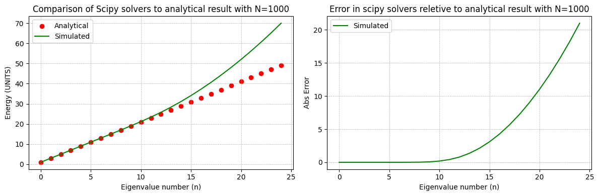
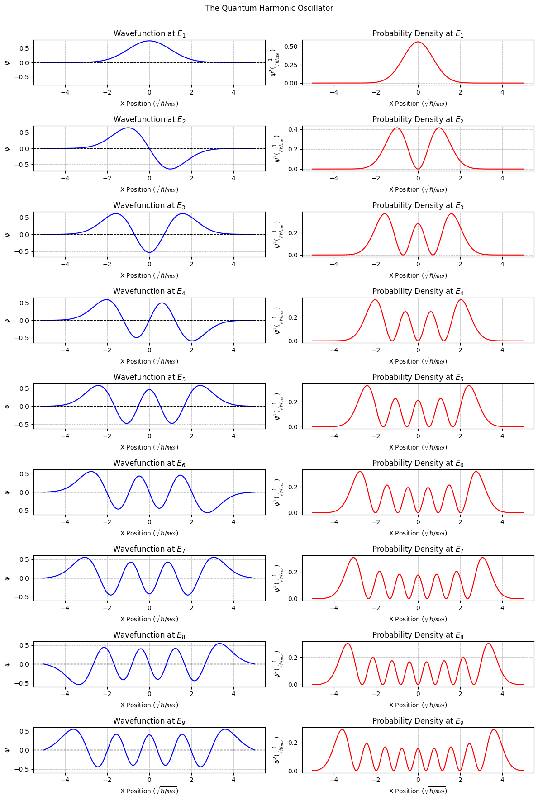
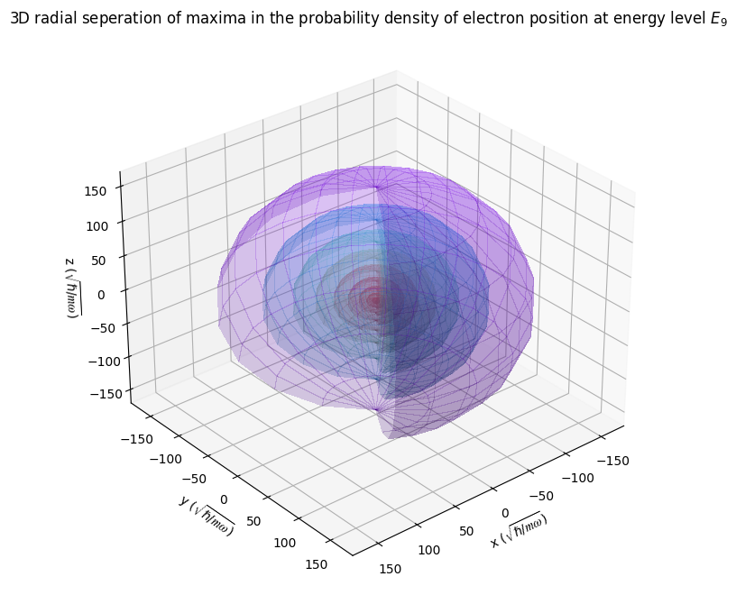
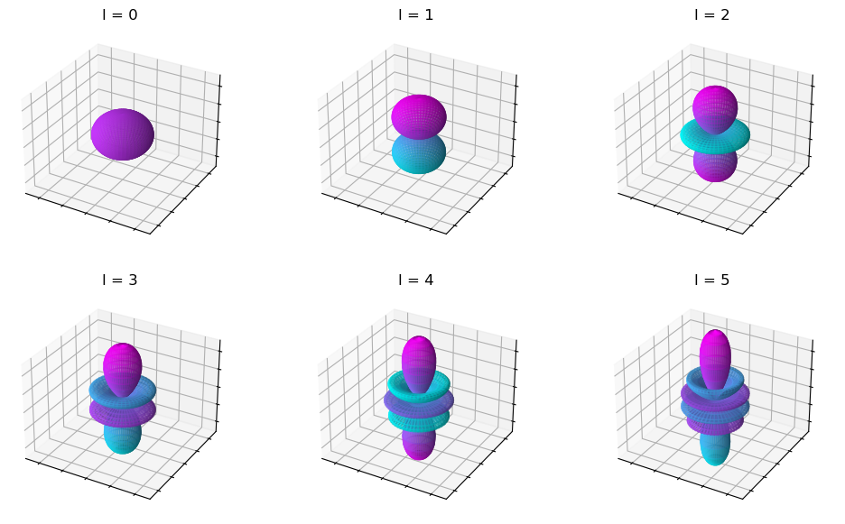
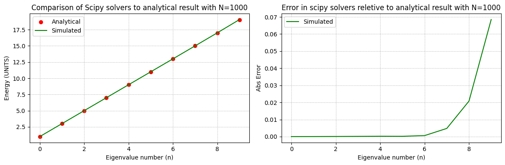
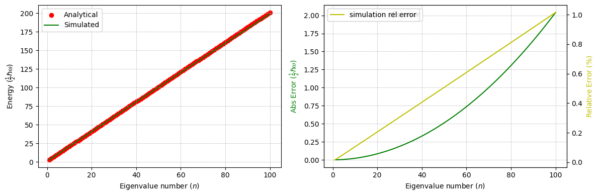
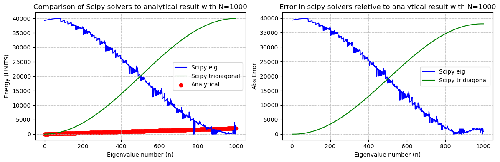
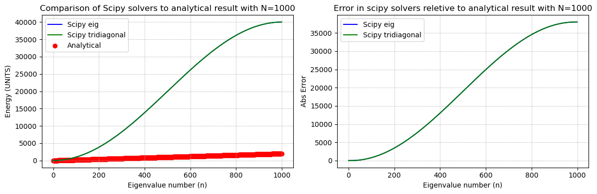

# QuantumHarmonics
### Author: Adill Al-Ashgar
#### Simulate Quantum Harmonic Wavefunctions to Visulise Quantum Number Effect on Electron Density Clouds

 

Implements the 1D Time-Independant Schrödinger Equation (TISE) using numerical methods.

Solves for the eigenvalues and eigenvectors of the Quantum Harmonic Oscillator (QHO) and the Hydrogen Atom.

Visulises the wavefunctions and probability density of the QHO and Hydrogen Atom, and how they relate to the energy states and quantum numbers.

 

## Table of Contents
- [Introduction](#Introduction)
- [Part 1 - The Quantum Harmonic Oscillator](#Part-1---The-Quantum-Harmonic-Oscillator)
  * [Analytical](#Analytical)
  * [Simulation](#Simulation)
  * [Combined Visulisation of Potential, Energy Levels and Position Probability Density for QHO](#Combined-Visulisation-of-Potential--Energy-Levels-and-Position-Probability-Density-for-QHO)
- [Part 2 - The Hydrogen Atom](#Part-2---The-Hydrogen-Atom)
    * [Simulation](#Simulation-1)
    * [Combined Visulisation of Potential, Energy Levels and Position Probability Density for Hydrogen Atom](#Combined-Visulisation-of-Potential--Energy-Levels-and-Position-Probability-Density-for-Hydrogen-Atom)
    * [Analytical](#Analytical-1)
- [Appendix](#Appendix)
    * [Quantum Numbers](#Quantum-Numbers)
        + [Spin Quantum Number (s)](#Spin-Quantum-Number--s-)
        + [Azimuthal Quantum Number (l)](#Azimuthal-Quantum-Number--l-)
        + [Magnetic Quantum Number (m)](#Magnetic-Quantum-Number--m-)
    * [Stability](#Stability)
- [References](#References)
- [License](#License)
- [Contributions](#Contributions)
- [Contact](#Contact)
- [Acknowledgements](#Acknowledgements)

# Introduction

Most of us will have vague memories of physics classes in school, during which we were taught about how objects move based on the forces that are acting upon them. This branch of physics, essentially the study of how things move and why they are where they are, is known as 'Mechanics'. Issiac Newton's laws of motion are the foundation of mechanics and for this reason it is often refered to as 'Newtonian Mechanics'. Though genrally the are is now refered to as 'classical Mechanics' as it has been superseeded by a more accurate and fundamental theory of the universe and the subject of this simulation and discussion, Quantum Mechanics. 

The first sentance that usually follows any mention of quantum mechinics is to add that noone not event the people working with it daily understand it. This is not true, but does make for more exciting media coverage and is appreciated both by the media outlets and the scientists doing quantum wheelies. The theory is well understood and has been tested to an incredible degree of accuracy, furthermore many aspects of quantum mechincs are actually incredibly intuitive, easy to understand and downright beautiful. The reason for the rep as being to complicated to understand comes from certain areas of the theory where we are able to use the mathmatical formulisms to generate correct predictions about the real world however our verbal and mental explination for the physical significance of the actual mechnisms behind what is happening are still in dispute. This is not unique to quantum mechinics, a good example is gravity, we are able to use our current mathmatical forulisms for gravitation to calulate answers to a high degree of accuracy, however we do not have a complete understanding of the physical significance of the mechnisms behind it, Einstien brought our understanding to a new level with his theory of general relativity showing the effetc of gravity are due to a curvature of space-time rather than a force acting at a distance, yet we are still unable to provide a explination of the pysical mechainisms give rise to the curvature, or even what it actully means for space-time to curve. It is a fair point to raise to say that our current thedry of gravity is already known to be incomplete as it is a classical theory of gravity and we are yet to be able to incorperate gravity into our current quantum frameworks (this persuit is often known as the search for the theory of everything, as quantum field theory doosent currently describes every single fundemental particle and fundemental foce of nature other than gravity) however the point still stands that we are able to use the mathmatical forulisms to make correct predictions about the world, whilst not being able to explain the physical mechanism in a way that is intuitive to us and we do not hear people denouncing gravity as beyond our conception everytime it is mentioned.

This simulation and write up aims to provide a way to bring together many seemingly disparate concepts in quantum mechanics to provide a more intuitive understanding of the subject. We also approch the topic from the concept of 'quantisation' and 'potential energy' that will feel very familliar to anyone who has walked up a hill or set of stairs before. 

# Quantum Mechanics (Brief Overview)
but the theory is so different from our everyday experience that it is hard to understand. The theory is based on the idea that the fundemental building blocks of the universe are not particles but waves, and that these waves are not waves of anything we can imagine, they are waves of probability.

## Quantisation
One of the main ideas of quantum meachnics that sets it apart from classical mechincs and contributes to he name of the field is the idea of **quantisation**. In classical mechanics we are used to the idea that reality is continuos, meaning you may be here, there, somwherein between the tow places, you might have a speed of 5m/s or 5.5m/s or 5.55 m/s we are used to the idea that there are indfinitely more smaller divisions of everything. In quantum mechanics however, we find that certian properties of the universe are quantised, meaning they can only take on certian values, and these values are not continous, they are discrete. This is actually incredibly intuitive idea, especially to any programmers out there, who are used to having to work in discrete values even if you wish you didnt have to. 

This si quite a simple concept, on the one hand you coul dimaging a hill with a perfectly flat and sloped side being the continuous universe, wehre you can take any height position on thew hill, and then you could imagine beside it a set of steps, where you can only take on certian heights, and you can only move up or down in steps. This is the idea of quantisation, and it is a fundemental aspect of quantum mechanics. It actually greatly simplifies reality as there is no longer infginte space between any two points, and it explains the lack of diversity in the universe, as there are only certian 
values that are allowed and so we will conformity in the fundemantal building blocks across the universe compared to one with continuos properties. 

## Understanding Atoms
ytou may say okay that is simple but what was the need for us to switch to this when we already had a perfectly nice continuos world view, cant we just stick to that. The answer is that the development of quantum mechnics was down to reality tellin gus that our previous ideas were wrong. One of the first indication that the universe was not as we thought came from the study of atoms. We had a pretty good idea of what they were made of, a nucleas in the centre made of protons and neutrons, and then electrons orbiting the nucleas. The problem was that the electrons were not behaving as we expected them to.

## Quantum Numbers

## Fundemental Properties
One aspect of quantum mechanics that can be foriegn to people is the idea that certian properties that we think of as being intrinsic to an object, such as its position are not fundemental at all. A way to analogise this that immidetly makes sense is to imagine you are playing a computer game, you walk into a room in the game and there is an object in the room. The people who created the game may have defined in the games code that this item is to appear in this fixed position in the room, we would say that the object has a position that is fundemental. This is how classical mechanics functions, in that in classical mechanics we assume that objects intrisicly have a fundemental position, and then we just observe what that fundentmal position is. Quantum mechanics however is quite different from this natural assumption. In quatum mechanics certian properties that we think of as being intrinsic to an object, such as position are not fundemental at all. In the example of our game, instead of the code specifying the posiiton of the object, the code specifies a probability distribution of the position of the object, meaning the code specifies a range of possible locations and a probability of the object being in each of these locations, maybe a 10% chance of being in room A and 90% in room b, then when we play the game and load into the mission the ojects position will be randomly selected based ont heprabbailities and fixed in one of these locations. In this case the reality of the object is that it does not have a **fundemental** position, rather **it** has a probability distribution of positions and then when we load the game it takes a fixed position. The underlying reality of position is statistical not the other way round. Everything so far has been pretty simple, but we cannot avoid the question, in real life when do objects go from thier probability thingy to actually being in a position? This is a shame as it is almost the first question anyone would ask and is the exact part of quatum mechanics that is currently hotly debated, we do not have a way to describe the physical significance and mechanism for this process, leading to many curious people getting bogged down right from the start. In our game analogy the object becomes fixed in a place when the game level loads, in reality qauntum objects take a fixed position when they are measured, which is known as the 'collapse' of the wavefunction. Luckily this question, whilst incredible interesting, is not neccesary to understand any of the rest of quantum mechanics and for those interested is already widely covered. We shall skirt round when and how things go from probabilities to 'localised' in this write up, and focus on the more intuitive aspects of quantum mechanics. 

You may be thinking well that is interesting but what does it matter if in the code the item is defined as a fixed position or a probability distribution, as once I'm in the game it take on a fixed position either way, and the probility code is then meaningless! This is a fair point and where my analogy falls down, as in our game example the interactions the object is a part of are calulated based on the expression of its position at that time. In reality, interactions of quantum mechanical systems and objects happen based on the fundemental properties not the macroscopic expressions, and the fundemental properties do not include position, rather the wavefunction. 

## Simulting Some Quantum Phenomena
The feild of quantum mechanics has revolutionized our understanding of the microscopic world. Central to this framework is the Schrödinger equation, a cornerstone equation in quantum mechanics that governs the behavior of quantum systems. the time independant shcrodinger equation describes the wavefunctions and energy levels of a quantum system. 

Eigenvalues represent the possible energy states of a quantum system, providing insights into the quantized nature of energy levels. These energy levels dictate the behavior and stability of the system, serving as a fundamental aspect of its characterization. Concurrently, eigenvectors correspond to the spatial distribution probability density of particles within the system. Understanding these eigenvectors enables us to comprehend the probability of finding a particle at a particular position within the system, thereby elucidating its spatial characteristics.

The utilization of numerical methods in solving the Schrödinger equation is paramount due to the inherent complexity of quantum systems. Analytical solutions are often infeasible for intricate systems, necessitating numerical techniques for accurate computations. Through numerical methods, we can approximate the eigenvalues and eigenvectors, consequently deducing the energy levels and spatial distributions of particles within the quantum system.

Thus, by employing numerical methods to solve the 1D Schrödinger equation, we embark on a quest to unravel the mysteries of quantum systems, particularly focusing on understanding the energy levels and spatial distributions of particles within these systems. This endeavor not only deepens our comprehension of quantum mechanics but also unveils the intricate workings of nature at its most fundamental level.

## Part 1 - The Quantum Harmonic Oscillator 

#### Simple Harmonic Oscillaror
The simple harmonic oscillator is a fundamental concept in classical mechanics, representing a classical system that oscillates about an equilibrium position, (think of a pendulum as it ticks back and forth.) If you take a pendulum thta is not movingf and is steady at equilibrum and pull it to one side and let go, it will swing back and forth, the further you pull it, the higher it will swing when it goes to the other side, that is becasue the higer you raise the pendulum the more **potential energy** you provide it, which is released when you let go. The potential energy of the harmonic oscillator is given by a quadratic function, resulting in a restoring force that is proportional to the displacement from the equilibrium position. This sounds incredibly basic but this simple system is a cornerstone of classical mechanics, serving as a fundamental model for various physical systems i.e springs, etc.

#### Quantum Harmonic Oscillator
The quantum harmonic oscillator is a quantum mechanical analogue of the classical harmonic oscillator outlined, representing a quantum system that oscillates about an equilibrium position. this could be a particle in a potential well, or a vibrating diatomic molecule. The quantum harmonic oscillator is a good example situation to use to start building our simulation, since it is an easy concept to understand and has exact analytic solutions we can use to validate our simulations results. 

Now we may ask ourselves, for a particle in a potential well, what are the possible states it can be in? What fundemental properties make up a complete description of its state? Well we can totally sum up the complete state of the particle of we know its potential enegry, as we have discussed the potential energy is directly related to the displacement, i.e the potentrial energy tells us the position of the particle. We also need to know the kinetic energy of the particle, as the kinetic energy is related to the velocity of the particle, and the velocity is related to the momentum of the particle. So if we know the potential energy and the kinetic energy of the particle we know everything about the particle. This is the fundemental idea behind the time independant schrodinger equation, it is a way to find the potential and kinetic energy of a quantum particle in a potential well, and then we know everything about the particle.

The energy levels $E_n$, and the wavefunctions $\psi$ of the quantum harmonic oscillator can be calculated from the eigenvalues and eigenvectors of the Schrödinger equation for a one-dimensional harmonic oscillator potential. The time-independent Schrödinger equation in 1D can be written :

The quantum harmonic oscillator is a good example to start with, since it has exact analytic solutions. 

### Analytical 

#### Eigenvalues (Energy Levels)
Analytically the energy levels of the quantum harmonic oscillator are given by :

$$
E_n = \hbar \omega (n + \frac{1}{2})  \tag{1}
$$

where $n$ is a non-negative integer representing the primary quantum number of the energy level, $\hbar$ is the reduced Planck constant, and $\omega$ is the angular frequency of the oscillator. This equation represents the quantization of energy levels in the quantum harmonic oscillator. Each energy level is equally spaced, with a separation of $\hbar \omega$ between adjacent levels so the energy eigenvalues are simply $n + \frac{1}{2}$. Given we are expressing energy in terms of $\frac{1}{2} \hbar \omega$, the energy levels simplify to odd integers given by $2n + 1$.

| n   | Analytical Result         | In terms of $\frac{1}{2}ℏ𝜔$ |
|-----|----------------|-------------------|
| 0   | $\frac{1}{2}ℏ𝜔$  | 1                 |
| 1   | $1\frac{1}{2}ℏ𝜔$ | 3                 |
| 2   | $2\frac{1}{2}ℏ𝜔$ | 5                 |
| 3   | $3\frac{1}{2}ℏ𝜔$ | 7                 |
| 4   | $4\frac{1}{2}ℏ𝜔$ | 9                 |
| 5   | $5\frac{1}{2}ℏ𝜔$ | 11                |
| 6   | $6\frac{1}{2}ℏ𝜔$ | 13                |
| ... | ...            | ...               |

*Caption*

#### Eigenvectors (Wavefunctions)
The eigenvectors are given by :

$$
\psi_n(x) = \frac{1}{\sqrt{2^n n!}} \left(\frac{m \omega}{\pi \hbar}\right)^{1/4} e^{-\frac{m \omega x^2}{2 \hbar}} H_n\left(\sqrt{\frac{m \omega}{\hbar}} x\right)  \tag{2}
$$

where $H_n$ are the Hermite polynomials. 

Plotting the first 4 analytically derived wavefunctions we get :

*Caption*

We can use the above to test our numerical method.  We will choose a value for $\omega$ and a range of $x$ values, and use the above to construct the Hamiltonian matrix $H$.  We can then use a linear algebra solver to find the eigenvalues and eigenvectors of $H$, and compare the results to the analytical solutions.

???????????????We will use the scipy.linalg.eigh_tridiagonal function to solve the eigenvalue problem, which is a wrapper for the LAPACK functions for solving the eigenvalue problem for a symmetric tridiagonal matrix. We will use the scipy.special.hermite function to calculate the Hermite polynomials.
???????????

### Simulation 

We will attempt to calulate the eigenvalues and eigenvectors by solving the time independant schrodinger equation using numerical methods and compare the results to the exact analytical solutions shown above. 

## Part 1

The quantum harmonic oscillator is a good example to start with, since it has exact analytic solutions for validation. The energy levels $E_n$, and the wavefunctions $\psi$ of the quantum harmonic oscillator can be calculated from the eigenvalues and eigenvectors of the Schrödinger equation for a one-dimensional harmonic oscillator potential. The time-independent Schrödinger equation in 1D can be written :

$$
\hat{H} \psi = \hat{E} \psi \tag{FIX!!} 
$$

The Hamiltonian operator $\hat{H}$ is given by 

$$
\hat{H} = \frac{-\hbar^2}{2m}\frac{d^2}{dx^2} + V \tag{3}
$$

Where:
- $\hat{H}$ is the Hamiltonian operator.
- $\hbar$ is the reduced Planck constant.
- $m$ is the mass of the oscillator.
- $V$ is the potential energy function.

For the quantum harmonic oscillator, the potential is :

$$
V(x) = \frac{1}{2}m \omega^2 x^2   \tag{7}
$$

where $\omega$ is the angular frequency of the oscillator.

*Caption*

In order to find numerical solutions, we can divide the spatial dimension into $N$ discrete points, $x_i$, and evaluate $\psi$ at each one.  Given this, equation 3 becomes a matrix equation, with $\psi$ an $N$-dimensional vector, and $H$ an $(N \times N)$ matrix.  We can then find the eigenvalues and eigenfunctions of the equation using numerical methods.

In order to define the matrix $\hat{H}$, we can use a discrete approximation of the 2nd derivative :
$$
\frac{d^2}{dx^2} \psi(x_i) \rightarrow \frac{\psi_{i-1} - 2\psi_i + \psi_{i+1}}{(\Delta x)^2}  \tag{4}
$$

where $(\Delta x)$ is the distance between discrete points $x_i$. We will choose dimensionless units for each problem, where $x$ is measured in terms of a length $a$, and $E$ is therefore measured in units of $\frac{\hbar^2}{2m a^2}$.  We can therefore write the kinetic energy term of the Hamiltonian as a "tri-diagonal" matrix $D$, which has the leading diagonal :

$$
D_{i,i} = \frac{2}{(\Delta x)^2}  \tag{5}
$$

and the diagonals above and below this are :

$$
D_{i,i+1} = D_{i,i-1} = \frac{-1}{(\Delta x)^2}   \tag{6}
$$

If we choose to measure $x$ in units of $\sqrt{\frac{\hbar}{m \omega}}$, then $E$ will be measured in units of $\frac{1}{2}\hbar \omega$, and the potential can be written :

$$
V_i(x_i) = i^2 (\Delta x)^2 = x_i^2   \tag{8}
$$

The potential term can be represented by a matrix where the leading diagonal is the potential evaluated at the $i$-th point in space, $V_{i,i} = V(x_i)$, and all other entries are zero. 

Then using a linear algebra solver, we can solve for the eigenvalues and eigenvectors of $H$ to find the energy levels $E_n$ and wavefunctions $\psi$ of the quantum harmonic oscillator respectivly.

##### NOTE:
It is important to use a large number of $x$ points, at least 1000, covering sufficient range that the wavefunction falls to zero at the extremities in order to ensure the numerical solutions stability as demonstrated in [Appendix Section 2.1](#Appendix_stability).

#### Eigenvalues (Energy Levels)

We compare the computed eigenvalues with the expected eigenvalues.

Looking back on our table of analytical values for the energy levels, and filling in our simulated values we can see we get a good match at low n but the error increases as n increases

| n   | Analytical Result         | in terms of $\frac{1}{2}ℏ𝜔$ | Simulation Result | Simulation Error |
|-----|----------------|-------------------|-------------------|------|
| 0   | $\frac{1}{2}ℏ𝜔$  | 1                 | 1.00              |0.00|
| 1   | $1\frac{1}{2}ℏ𝜔$ | 3                 | 3.00              |0.00|
| 2   | $2\frac{1}{2}ℏ𝜔$ | 5                 | 4.99              |0.01|
| 3   | $3\frac{1}{2}ℏ𝜔$ | 7                 | 6.98              |0.02|
| 4   | $4\frac{1}{2}ℏ𝜔$ | 9                 | 8.97              |0.03|
| 5   | $5\frac{1}{2}ℏ𝜔$ | 11                | 10.96             |0.04|
| 6   | $6\frac{1}{2}ℏ𝜔$ | 13                | 12.95             |0.05|
| ... | ...            | ...               | ...               |...|

*Caption*

To get a better idea of the error we can plot the error as a function of n, the results show good agreement between simulation and anylitical results for low n up to around 10, after which the error increases rapidly. 

*CaptionGRAPH NEEDS UNITS!!!*

#### Eigenvectors (Wavefunctions)

Next you should plot the wavefunctions, ie. the eigenvectors.  Rather than plot the wavefunction directly, you should plot the probability density, which is given by $\psi^2$, and indicates the probability to find the particle at position $x$.

*Caption*

### Combined Visulisation of Potential, Energy Levels and Position Probability Density for QHO

*The dotted u shape line shows the potential that we caluclated, combining the potential and the wavefunctions on this one plot allows us to see the classical limits, where the potential crosses each wavefunction. Classically the wavefucntion is not allowed to have a value other than 0 past these limits (turning points) but we can see here that it does, this is one of the dissagremments between classical and quantum theory.*

# Part 2 - The Hydrogen Atom

### Simulation

Having verified our method, we can use it to find the eigenvalues of a more complex system - the Hydrogen atom.  In a spherically symmetric system, the wavefunction can be written :

$$
\frac{1}{r}\Psi(r)Y_{lm}(\theta, \phi)e^{i m\phi} \tag{9}
$$

where $Y_{lm}(\theta, \phi)$ are the spherical harmonic functions and l, m are the angular momentum quantum numbers. The radial function $\Psi(r)$ satisfies the time-independent Schrödinger equation, provided a suitable term is added to the potential.

Now that we are using a spherical coordinate system, we discritise a range of radius values, $r$, instead of $x$. If we use the Bohr radius $a_0$ as the unit $r$, where :

$$
a_0 = \frac{4 \pi \epsilon \hbar^2}{m_e e^2}  \tag{10}
$$

then the energy will be measured in units of :
$$
\frac{m_e e^4}{2 (4 \pi \epsilon_0)^2 \hbar^2}  \tag{11}
$$

and the potential for the hydrogen atom can be written :

$$
V(r_i) = \frac{-2}{r_i} + \frac{l(l+1)}{r_i^2} \tag{12}
$$

These are called Rydberg atomic units, and greatly simplify our calulations. The potential is the sum of the classical attractive Coulomb interaction between the electron and the nucleus, and an additional term dependent on the azimuthal quantum number $l$. This term is related to the centrifugal potential, which arises due to the angular momentum of the electron. Let's analyze how this potential changes with respect to $l$:

1. **$l = 0$ (s orbital)**:
   When $l = 0$, the term $l(l+1)/r^2$ vanishes, and the potential reduces to $V_{\text{hyd}} = -2/r$, which in non-atomic units corresponds to the classical coulumb potential:
   
   $$ 
   V(r) = -\frac{k \cdot e^2}{r} \tag{13SORT!!} 
   $$
   
   . This corresponds to the s orbital, which is spherically symmetric. The potential is solely determined by the attractive Coulomb interaction between the electron and the nucleus.

2. **$l > 0$ (p, d, f orbitals, etc.)**:
   For $l > 0$, the term $l(l+1)/r^2$ becomes non-zero. This term contributes an additional repulsive component to the potential. As $l$ increases, this repulsive centrifugal potential becomes stronger. This reflects the fact that electrons in higher angular momentum states experience a stronger "centrifugal force" due to their higher orbital angular momentum.

   - For $l = 1$ (p orbitals), the term becomes $1/r^2$, providing an additional repulsive contribution to the potential.
   - For $l = 2$ (d orbitals), the term becomes $2/r^2$, which is stronger than for $l = 1$ and contributes even more repulsion.
   - This trend continues for higher $l$ values, with the repulsion becoming more significant as $l$ increases.

Overall, for higher values of $l$, the potential energy becomes more repulsive at shorter distances compared to the $l = 0$ case, reflecting the increased centrifugal effect due to the higher angular momentum of the electron. This behavior is characteristic of the different shapes of orbitals associated with different values of $l$ in atomic systems.

*Columb potential*

*Quantum Hydrogen potential, varying $l$, can see that when $l = 0$ the potential is the standard columb potential, but as $l$ increases, the centrifugal potential term increases*

We can now use the same method as outlined in section 1 to create the kinetic energy term matrix $D$ and add it to the potential $V$, to find the Hamiltonian matrix $H$. We agin use our linear algebra solver to find the eigenvalues and eigenvectors of $H$, and compare the results to the expected eigenvalues and wavefunctions, this time for the Hydrogen atom.

!!!! to generate the Hamiltonian matrix for the Hydrogren atom, and find at least the first 5 eigenvalues for at least l=0. Compare these eigenvalues with the expected eigenvalues.
!!!!

#### NOTE:
We must use a range of $r$ such that the wavefunction become negligible, and a large number of $r$ points, at least 1000, to ensure the numerical solutions stability as demonstrated in [Appendix Section 2.1](#Appendix_stability).

#### Eigenvalues (Energy Levels)

#### Eigenvectors (Wavefunctions)

*$l = 0$*

*$l = 3$*

### Combined Visulisation of Potential, Energy Levels and Position Probability Density for Hydrogen Atom

*Caption*

*Caption*

The energy scale describes the required energy to move the electron from its bound state to infinity, a simpler way to think of it is the sum total energy of the nucleas and the electron is this much lower (hence the negative) than if they were seperated by an infinite distance

In addition to the quantized negative energy states of the hydrogen atom, there is also a continuum of unbound positive energy states. 

### Analytical 

#### Eigenvalues (Energy Levels)

| n   | Analytical Result | in terms of $\frac{m_e e^4}{2 (4 \pi \epsilon_0)^2 \hbar^2}$ | Simulation Result ($\frac{m_e e^4}{2 (4 \pi \epsilon_0)^2 \hbar^2}$) | Simulation Error ($\frac{m_e e^4}{2 (4 \pi \epsilon_0)^2 \hbar^2}$) |
|-----|------------------|-------------------------------|-------------------|------|
| 0   | $-1.000 \frac{m_e e^4}{2 (4 \pi \epsilon_0)^2 \hbar^2}$  | -1.0000                      | -1.0433           |-0.0433|
| 1   | $-0.250 \frac{m_e e^4}{2 (4 \pi \epsilon_0)^2 \hbar^2}$ | -0.2500                      | -0.2553           |-0.0053|
| 2   | $-0.111 \frac{m_e e^4}{2 (4 \pi \epsilon_0)^2 \hbar^2}$ | -0.1111                      | -0.1127           |-0.0017|
| 3   | $-0.063 \frac{m_e e^4}{2 (4 \pi \epsilon_0)^2 \hbar^2}$ | -0.0625                      | -0.0632           |-0.0007|
| 4   | $-0.040 \frac{m_e e^4}{2 (4 \pi \epsilon_0)^2 \hbar^2}$ | -0.0400                      | -0.0403           |-0.0003|
| 5   | $-0.027 \frac{m_e e^4}{2 (4 \pi \epsilon_0)^2 \hbar^2}$ | -0.0278                      | -0.0280           |-0.0002|
| 6   | $-0.020 \frac{m_e e^4}{2 (4 \pi \epsilon_0)^2 \hbar^2}$ | -0.0204                      | -0.0205           |-0.0001|
| ... | ...            | ...               | ...               |...|

*Caption*

The pattern in the given fractions seems to involve decreasing magnitudes of the fractions with a negative sign. Let's analyze:

-1 = -1/1
-0.25 = -1/4
-0.111 = -1/9
-0.0625 = -1/16
-0.04 = -1/25

Each fraction appears to be the reciprocal of the square of an integer:

1^2 = 1
2^2 = 4
3^2 = 9
4^2 = 16
5^2 = 25

So, the pattern is:

-1/(n^2)

To convert our  dimensionless results given in terms of $\frac{m_e e^4}{2 (4 \pi \epsilon_0)^2 \hbar^2}$ we can solve for the energy levels in terms of eV, by inputting the required constants :

- $m_e$: mass of an electron $\approx 9.109 \times 10^{-31}$ kg
- $e$: elementary charge $\approx 1.602 \times 10^{-19}$ C
- $\epsilon_0$: vacuum permittivity $\approx 8.854 \times 10^{-12}$ F/m
- $\hbar$: reduced Planck constant $\approx 1.055 \times 10^{-34}$ J·s

Which yeilds :
$$
\frac{(9.109 \times 10^{-31}) \times (1.602 \times 10^{-19})^4}{2 \times (4 \pi \times 8.854 \times 10^{-12})^2 \times (1.055 \times 10^{-34})^2} \approx 13.606 \, \text{eV} \tag{13}
$$

Which we know is the enrgy of the ground state of the hydrogen atom, and each energy level is a multiple of this value. We can then convert our dimensionless results to eV by multiplying by 13.606.

| n   | Analytical Result (eV) | Simulation Result (eV) | Simulation Error (eV)|
|-----|-------------------------------|-------------------|------|
| 0   | -13.6060                     | -14.1712          | -0.5905|
| 1   | -3.4015                      | -3.4713           | -0.0721|
| 2   | -1.5095                      | -1.5318           | -0.0232|
| 3   | -0.8547                      | -0.8597           | -0.0095|
| 4   | -0.5442                      | -0.5488           | -0.0041|
| 5   | -0.3774                      | -0.3801           | -0.0014|
| 6   | -0.2768                      | -0.2796           | -0.0007|
| ... | ...                          | ...               |...|

*Caption*

*Caption*

comments on error of hydrogen simulation 

#### Eigenvectors (Wavefunctions)

*Caption QHO  Analytical to simulation wavefucn and prob density comparisons*

*Caption 1D & 2D visualisations of the Hydrogen electron position probability density*

*Caption 3D visualisation of the Hydrogen electron position probability density*

##### NOTES!¬!!

Report:

To find the values of the allowed energy eigenvalues of a quantum system we have to apply the hamiltonian opperator to the wavefunction $(\psi)$. To simplify the problem we have taken it in one dimension and in time independsnt form where the wavefuntion is just a function of $x$ $\psi(x)$

$$H \psi(x) = E \psi(x)$$

The Hamiltonian $H$ is given by 

$$H = \frac{-\hbar^2}{2m}\frac{d^2}{dx^2} + V $$

it contains two terms, the potential energy term V and the kinetic energy term D where 

$$D = \frac{-\hbar^2}{2m}\frac{d^2}{dx^2}$$

the potential term can be implemented easily as a simple function, however D requires the use of numerical methods as it contains a continuous derivative.

Given this, the hamiltonian is implemented as a matrix equation, with $\psi$ an $N$-dimensional vector, and $H$ an $(N \times N)$ matrix.
The matrix is symmetric, we can find the eigenvalues and eigenfunctions of the matrix using readily availibly pyton routines from the scipy libraries. I chose to test two solvers, scipy.linalg.eig and scipy.linalg.eigh_tridiagonal to compare their results. At first the eig fucntion was returning some strange results but then i realised the returned values were not sorted, so after adding a quicksort function via np.sort() it returned the exact same results as the eigh_tridiagonal function.

As both function methods returned the exact same results it would be down to compute resources rather than accuracy to pick one, i did not implement a time loop to test the difference as my code is alredy substantial. Without having tested it i would pick using the eigh_tridiagonal function as it requires a much simpler hamiltonian function, less memory usage from not having to store the majority 0 valued matricies, and requires no np.sort to return the results.

Testing both methods on the QHO problem and then comparing the Eigenvalues to the analytical results showed that the solvers can provide acuurate results for the QHO up to around an E_n value of 10. I then did the same for comparing eigenvectors to the analytical results but only the first 4 terms. The results of the solvers come out exactly mathcing the analytical eigenvectors albeit with a scale mismatch that i assume is down to a unit conversion scaling.

Then made some interesting plots of the wavefunctions and probability distributions for a range of the QHO's energy eigenstates, including one which overlayed the potental with the wavefunctions to demonstrate the mismatch in classical and quantum theory in the ability of the wavefucntion to have a value outside of the classicly deifned turning points.

Moved on to the hydrogen atom where ran through the same as for the QHO. Compared the potential of the QHO to the Hydrogen atom which showed interesting differences in the two systems. Also compared the analytical hydrogen eigenvalues with the solvers which provide accurate results up till around E_n 20 this time.

The previous visuals were all based on the radial wavefunction which each have a unique energy value, but the total wavefucntion for the hydrogen atom consists of the radial wavefunction and the angular wavefunction which gives each energy level above n=1 more than one possible state, they are degenerate. Created visulisations for the hydrogen atoms l and m quantum numbers in 2 and 3D to show how the various numbers effect the probability distribution of the electron, showing the degenerate states that give rise to the s, p... orbital shells.

## Appendix

### Quantum Numbers

Quantum numbers are numbers that specify the state of a quantum system. If you know all of the quantum numbers for a system that is a complete description of state. A way to analogise this is to think of a chess board. To have a full definition of the state of the chess game i.e. all the information required to exactly recreate the game, you could write down the information of whatis present in each qaure of the board. However, this fixes the information to the spacial domain, wheras in reality properties are tied to objects not the space they inhabit. Additonally stroign information for every square (spatial position) requires more information storage as data is kept on empty squares.For an object focused definiton of state in the smallest amount of information possible, you would need to know the piece type, color (white/black) and the board position for each piece on the board. The amount of information required to define the state of the chess game is 3 values per piece present on the board, we could give these three bits of information quantum numbers a b and c for chess pieces. 

An important note here is that although i have used the position of the chess peices as one of thier quantum numbers in this analogy, this is only to get across the conncept of a full definition of state for a system. There is no quantum number tied to position, they are tied to the properties of the object, from which the positotion is emergent. Further, quantum mechanics does not allow for the exact position of a particle to be known at all, only the **probability** of finding it in a certain position, which we derive from the wavefunction.

The quantum harmonic oscillator, which describes a particle (often an electron) confined in a quadratic potential well, possesses only one quantum number, which represents the energy level of the oscillator. This is the single piece of information required to define the entire state of the oscillating system. The quantum number representing the energy of a quantum system is called the principle quantum number, and is denoted by the letter $n$. Its values are non-negative integers (0, 1, 2, ...) meaning a quantum harmonic oscillator can have energy levels of n = 1, n = 2, n = 3 etc.

In the case of an electron in an atom the quantum numbers are more complex, as the electron is confined in a 3D potential well. The quantum numbers for an electron in an atom are the principal quantum number (n), the azimuthal quantum number (l), the magnetic quantum number (m), and the spin quantum number (s). The principal quantum number (n) is the same as for the quantum harmonic oscillator, and represents the energy level of the electron. The azimuthal quantum number (l) represents the angular momentum of the electron, and the magnetic quantum number (m) represents the projection of the angular momentum along a given axis. The spin quantum number (s) represents the intrinsic angular momentum of the electron, either spin up or spin down.

*Caption*

#### Spin Quantum Number (s)

#### Azimuthal Quantum Number (l)

#### Magnetic Quantum Number (m)

### Stability

*Caption*

*Caption*

*Caption*

*Caption*

*Caption*

## License
This project is not currently licensed. For more information please get in touch via the contact details below.

## Contributions
Contributions to this codebase are welcome! If you encounter any issues, bugs or have suggestions for improvements please open an issue or a pull request on the [GitHub repository](https://github.com/Adillwma/QuantumHarmonics).

## Contact
[adill@neuralworkx.com](mailto:adill@neuralworkx.com).

## Acknowledgements
Prof. Sandu Popescu, FRS for many inspiring and enlightening lectures. 

## References
