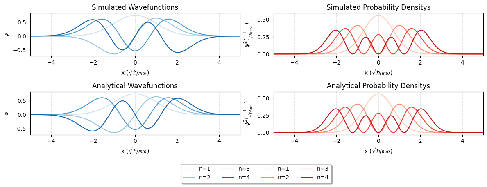
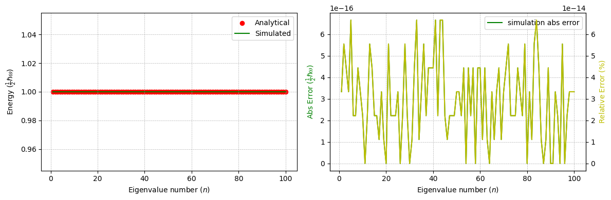
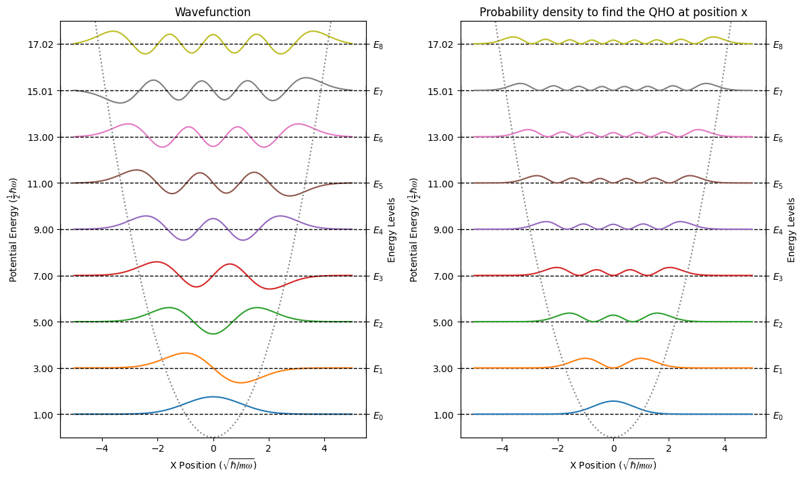
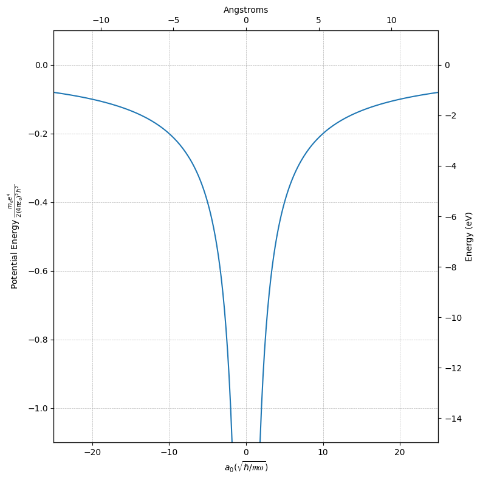

# QuantumHarmonics
### Author: Adill Al-Ashgar
#### Simulate Quantum Harmonic Wavefunctions to Visulise Quantum Number Effect on Electron Density Clouds

 

    Implements the 1D Time-Independant Schrödinger Equation (TISE) using numerical methods.

    Solves for the eigenvalues and eigenvectors of the Quantum Harmonic Oscillator (QHO) and the Hydrogen Atom.

    Visulises the wavefunctions and probability density of the QHO and Hydrogen Atom, and how they relate to the energy states and quantum numbers.

 

# Table of Contents
- [Introduction](#Introduction)

- [Part 1 - The Quantum Harmonic Oscillator](#Part-1---The-Quantum-Harmonic-Oscillator)
  - [Analytical Solution](#Analytical-Solution)
  - [Simulation](#Simulation)
  - [Combined Visulisation for QHO](#Combined-Visulisation-for-QHO)

- [Part 2 - The Hydrogen Atom](#Part-2---The-Hydrogen-Atom)
  - [Simulation](#Simulation-1)
  - [Analytical Solution](#Analytical-Solution-1)
  - [Combined Visulisation for Hydrogen Atom](#Combined-Visulisation-for-Hydrogen-Atom)

- [References](#References)
- [Appendix](#Appendix)
  - [Stability](#Stability)
  - [Performance](#Performance)
  - [QHO Analytical Wavefunction Reference Table](#QHO-Analytical-Wavefunction-Reference-Table)

- [Liscence](#Liscence)
- [Contributing](#Contributing)
- [Contact](#Contact)
- [Acknowledgements](#Acknowledgements)

# Introduction
Our current understanding of the most fundamental aspects of our universe comes from Quantum Mechanics. Central to this framework is the Schrödinger equation, a core equation in quantum mechanics that governs the behaviour of non-reletivistic quantum systems. A form of this equation known as the Time-Independent Schrödinger Equation or 'TISE' provides insights into the quantized energy levels and spatial distribution by finding the stationary states of a quantum system. Analytical solutions are often infeasible for complex systems, necessitating numerical techniques. This project is designed to solve the TISE numerically to simulate various quantum systems and visualize the results. A comparison is made to between some examples that do indeed have exact analytical solutions to validate the numerical results.

# Part 1 - The Quantum Harmonic Oscillator 
The Quantum Harmonic-Oscillator (QHO) is a quantum mechanical analogue of the classical harmonic oscillator, representing a quantum system that oscillates about an equilibrium position, such as a vibrating diatomic molecule. The quantum harmonic oscillator is a good example to begin building our simulation, since it has exact analytic solutions we can use to validate our simulations results.

## Analytical Solution

### Energy Levels
Analytically the **energy levels** of the **quantum harmonic oscillator** are given by :

$$
E_n = \hbar \omega (n + \frac{1}{2})  \tag{1}
$$

where $n$ is a non-negative integer representing the primary quantum number of the energy level, $\hbar$ is the reduced Planck constant, and $\omega$ is the angular frequency of the oscillator. 

This equation represents the **quantization** of energy levels in the quantum harmonic oscillator. Quantisation is an core idea of Quantum Mechanics (hence the name). In the case of the Quantum Harmonic Oscillator, each energy level is equally spaced, with a separation of $\hbar \omega$ between adjacent levels, so the eigenvalues are simply $n + \frac{1}{2}$. Given we are expressing energy in terms of $\frac{1}{2} \hbar \omega$, the energy levels simplify to odd integers given by $2n + 1$.

| n   | Analytical Result         | In terms of $\frac{1}{2}ℏ𝜔$ |
|-----|----------------|-------------------|
| 1   | $\frac{1}{2}ℏ𝜔$  | 1                 |
| 2   | $1\frac{1}{2}ℏ𝜔$ | 3                 |
| 3   | $2\frac{1}{2}ℏ𝜔$ | 5                 |
| 4   | $3\frac{1}{2}ℏ𝜔$ | 7                 |
| 5   | $4\frac{1}{2}ℏ𝜔$ | 9                 |
| 6   | $5\frac{1}{2}ℏ𝜔$ | 11                |
| 7   | $6\frac{1}{2}ℏ𝜔$ | 13                |
| ... | ...            | ...               |

*The table shows the first seven analytically derived energy states for the Quantum Harmonic Osciallator, we see that when the energy is expressed in terms of $\frac{1}{2}ℏ𝜔$ the energy levels are simply odd integers given by $2n + 1$.*

### Wavefunctions
The analytical **eigenvectors** $\psi_n$ of the QHO are given by,

$$
\psi_n(x) = \frac{1}{\sqrt{2^n n! \sqrt{\pi}}} e^{-\frac{x^2}{2}} H_n(x) \tag{2}
$$

This equation is made up of three terms, $\frac{1}{\sqrt{2^n n! \sqrt{\pi}}}$ is the normalization constant which ensures that the wavefunction is properly normalized, i.e. $\int_{-\infty}^{\infty} |\psi_n(x)|^2 dx = 1$. Next is the Gaussian term $e^{-\frac{x^2}{2}}$ representing the ground state probability distribution, which peaks at $x=0$ and decays rapidly as $x$ moves away from zero, and finally $H_n(x)$ is the Hermite polynomial of degree $n$, given by,

$$
H_n(x) = (-1)^n e^{x^2} \frac{d^n}{dx^n} e^{-x^2} \tag{3}
$$

Solving for the first three wavefunctions we get the following:

| Term | Normalisation Prefactor| Gaussian | Hermite Polynomial | Wavefunction Expression |
|------|------------|---------|--------|---------|
| 1 | $\frac{1}{\sqrt[4]{\pi}}$ | $e^{- \frac{x^{2}}{2}}$ | $1$ | $\frac{e^{- \frac{x^{2}}{2}}}{\sqrt[4]{\pi}}$ |
| 2 | $\frac{\sqrt{2}}{2 \sqrt[4]{\pi}}$ | $e^{- \frac{x^{2}}{2}}$ | $2 x$ | $\frac{\sqrt{2} x e^{- \frac{x^{2}}{2}}}{\sqrt[4]{\pi}}$ |
| 3 | $\frac{\sqrt{2}}{4 \sqrt[4]{\pi}}$ | $e^{- \frac{x^{2}}{2}}$ | $4 x^{2} - 2$ | $\frac{\sqrt{2} \cdot \left(4 x^{2} - 2\right) e^{- \frac{x^{2}}{2}}}{4 \sqrt[4]{\pi}}$ |
|...|...|...|...|...|

*The first three analytically solved wavefunctions for the Quantum Harmonic Oscillator. See [Appendix Section 1.3](#Appendix_QHOreferencetable) for a more comprehensive reference table.*

It is hard to get an idea of what these wavefunctions look like from the above table, but if we now plot the wavefunctions against the displacement in $x$ we get a much clearer view of thier shape and how that changes with the energy level.

*The first three analytically solved wavefunctions for the Quantum Harmonic Oscillator plotted against position*

## Simulation 

### Methodology
We will now attempt to calulate the eigenvalues and eigenvectors of the same QHO system, this time by solving the TISE using numerical methods. We can then compare the results to the exact analytical solutions shown above to validate our methodology.

The energy levels $E_n$, and the wavefunctions $\psi$ of the quantum harmonic oscillator can be calculated from the eigenvalues and eigenvectors of the Schrödinger equation for a one-dimensional harmonic oscillator potential. The time-independent Schrödinger equation in 1D can be written,

$$
\hat{H} \psi = \hat{E} \psi \tag{4} 
$$

The Hamiltonian operator $\hat{H}$ is given by 

$$
\hat{H} = \frac{-\hbar^2}{2m}\frac{d^2}{dx^2} + V \tag{5}
$$

Where:
- $\hbar$ is the reduced Planck constant.
- $m$ is the mass of the oscillator.
- $V$ is the potential energy.

For the quantum harmonic oscillator, the potential is :

$$
V(x) = \frac{1}{2}m \omega^2 x^2   \tag{6}
$$

where $\omega$ is the angular frequency of the oscillator.

*Caption*

In order to find numerical solutions, we can divide the spatial dimension into $N$ discrete points, $x_i$, and evaluate $\psi$ at each one.  Given this, equation 3 becomes a matrix equation, with $\psi$ an $N$-dimensional vector, and $H$ an $(N \times N)$ matrix.  We can then find the eigenvalues and eigenfunctions of the equation using numerical methods.

In order to define the matrix $\hat{H}$, we can use a discrete approximation of the 2nd derivative,

$$ 
\frac{d^2}{dx^2} \psi(x_i) \approx \frac{\psi_{i-1} - 2\psi_i + \psi_{i+1}}{(\Delta x)^2}  \tag{7}
$$

where $(\Delta x)$ is the distance between discrete points $x_i$. We will choose dimensionless units for each problem, where $x$ is measured in terms of a length $a$, and $E$ is therefore measured in units of $\frac{\hbar^2}{2m a^2}$.  We can therefore write the kinetic energy term of the Hamiltonian as a "tri-diagonal" matrix $D$, which has the leading diagonal,

$$
D_{i,i} = \frac{2}{(\Delta x)^2}  \tag{8}
$$

and the diagonals above and below this are,

$$
D_{i,i+1} = D_{i,i-1} = \frac{-1}{(\Delta x)^2}   \tag{9}
$$

If we choose to measure $x$ in units of $\sqrt{\frac{\hbar}{m \omega}}$, then $E$ will be measured in units of $\frac{1}{2}\hbar \omega$, and the potential can be written,

$$
V_i(x_i) = i^2 (\Delta x)^2 = x_i^2   \tag{10}
$$

The potential term can be represented by a matrix where the leading diagonal is the potential evaluated at the $i$-th point in space, $V_{i,i} = V(x_i)$, and all other entries are zero. 

Then using a linear algebra solver, we can solve for the eigenvalues and eigenvectors of $H$ to find the energy levels $E_n$ and wavefunctions $\psi$ of the quantum harmonic oscillator respectivly. For performance reasons we currently use the scipy.linalg.eigh_tridiagonal function, benefiting from its tailored functionality for diagonal and tridiagonal matrices. This is dicussed further in [Appendix Section 2.2](#Appendix_performance).

##### NOTE:
It is important to use a small $(\approx 0.1 a_o)$ step size for $\Delta x$. Additonally the x displacement (from which follows the range for the potential) must covering sufficient range that the largest desired wavefunction falls to zero at the extremities in order to ensure the numerical solutions stability as demonstrated in [Appendix Section 2.1](#Appendix_stability).

### Energy Levels

We compare the computed eigenvalues with the expected eigenvalues.

Looking back on our table of analytical values for the energy levels, and filling in our simulated values we can see we get a good match between the two, with the error gradlly increasing as the energy level increases. This is to be expected as the wavefunctions become more complex and the numerical solutions become less stable. 

| n   | Analytical Result         | in terms of $\frac{1}{2}ℏ𝜔$ | Simulation Result | Simulation Error |
|-----|----------------|-------------------|-------------------|------|
| 0   | $\frac{1}{2}ℏ𝜔$  | 1                 | 1.00              |0.00|
| 1   | $1\frac{1}{2}ℏ𝜔$ | 3                 | 3.00              |0.00|
| 2   | $2\frac{1}{2}ℏ𝜔$ | 5                 | 4.99              |0.01|
| 3   | $3\frac{1}{2}ℏ𝜔$ | 7                 | 6.98              |0.02|
| 4   | $4\frac{1}{2}ℏ𝜔$ | 9                 | 8.97              |0.03|
| 5   | $5\frac{1}{2}ℏ𝜔$ | 11                | 10.96             |0.04|
| 6   | $6\frac{1}{2}ℏ𝜔$ | 13                | 12.95             |0.05|
| ... | ...            | ...               | ...               |...|

*Caption*

To get a better idea of the error we can plot it as a function of n, the results show good agreement between simulation and anylitical results, a full exploration of the error as a function of the input parameters is given in [Appendix Section 2.1](#Appendix_stability). 

*The left hand plot shows the results for the first 100 energy lavels of our simulation compared to the analytical results shown in red. The plot on the right shows both the absoloute error (shown in green and referenced to the left y-axis) and the reletive error as a percentage of the true value (shown in yellow and referneced to the right hand y-axis.)*

### Wavefunctions
We can also compare our numerically computed wavefucntions to their analytical counterparts to check that our simulation is working as expected. 

*QHO  Analytical to simulation wavefucn and prob density comparisons*

In this visual comparison we can see that the wavefunctions are in good agreement with the analytical solutions, with the only difference being a phase factor in one of the waves. This is to be expected as the phase is not a physical observable and is therefore not unique. This phase shift does not effect the probability density, which we find to be in good agreement with the analytical solutions. This is quantified further in [Appendix Section 2.1](#Appendix_stability).

*Quantisation error in normalisation constraint for probability amplitudes*

Now we have verified our simulation works as expected, we can move on to visulising the wavefunctions and probability density of the QHO in more detail.

*Caption*

the probability density, which is given by $\psi^2$, and indicates the probability to find the particle at position $x$.

## Combined Visulisation for QHO

*The dotted u shape line shows the potential that we caluclated, combining the potential and the wavefunctions on this one plot allows us to see the classical limits, where the potential crosses each wavefunction. Classically the wavefucntion is not allowed to have a value other than 0 past these limits (turning points) but we can see here that it does, this is one of the dissagremments between classical and quantum theory.*

# Part 2 - The Hydrogen Atom
Having verified our method, we can use it to find the eigenvalues of a slightly more complex system - the Hydrogen atom. We will use same methodology as before but change the potential to that of the hydrogen atom. The eigenvalues and eigenvectors will then yeild the energy levels and wavefunctions of the hydrogen atom, which we shall again compare to analytical results.

## Simulation

### Methodology
In addition to having to change the potential, we will also change to a spherical coordinate system to simplify our calculations as the hydrogen atom is spherically symmetric. In such a spherically symmetric system, the wavefunction can be written :

$$
\frac{1}{r}\Psi(r)Y_{lm}(\theta, \phi)e^{i m\phi} \tag{11}
$$

where $Y_{lm}(\theta, \phi)$ are the spherical harmonic functions and l, m are the angular momentum quantum numbers. The radial function $\Psi(r)$ satisfies the time-independent Schrödinger equation, provided a suitable term is added to the potential.

Now that we are using a spherical coordinate system, we discritise a range of radius values, $r$, instead of $x$. If we use the Bohr radius $a_0$ as the unit $r$, where :

$$
a_0 = \frac{4 \pi \epsilon \hbar^2}{m_e e^2}  \tag{12}
$$

then the energy will be measured in units of :
$$
\frac{m_e e^4}{2 (4 \pi \epsilon_0)^2 \hbar^2}  \tag{13}
$$

and the potential for the hydrogen atom can be written :

$$
V(r_i) = \frac{-2}{r_i} + \frac{l(l+1)}{r_i^2} \tag{14}
$$

This potential is the sum of the classical attractive Coulomb interaction between the electron and the nucleus, and an additional term dependent on the **azimuthal quantum number** $l$. This term is related to the centrifugal potential, which arises due to the angular momentum of the electron. If we analyse how the overall potential changes with respect to $l$:

1. **$l = 0$ (s orbital)**:
   When $l = 0$, the term $l(l+1)/r^2$ vanishes, and the potential reduces to $V_{\text{hyd}} = -2/r$, which in non-atomic units corresponds to the classical coulumb potential:
   
   $$ 
   V(r) = -\frac{k \cdot e^2}{r} \tag{15} 
   $$
   
   For those familliar with the orbital shell model, this corresponds to the s orbital, which is spherically symmetric. The potential is solely determined by the attractive Coulomb interaction between the electron and the nucleus.

*Columb potential*

2. **$l > 0$ (p, d, f orbitals, etc.)**:
   For $l > 0$, the term $l(l+1)/r^2$ becomes non-zero. This term contributes an additional repulsive component to the potential. As $l$ increases, this repulsive centrifugal potential becomes stronger. This reflects the fact that electrons in higher angular momentum states experience a stronger "centrifugal force" due to their higher orbital angular momentum.

   - For $l = 1$ (p orbitals), the term becomes $1/r^2$, providing an additional repulsive contribution to the potential.
   - For $l = 2$ (d orbitals), the term becomes $2/r^2$, which is stronger than for $l = 1$ and contributes even more repulsion.
   - This trend continues for higher $l$ values, with the repulsion becoming more significant as $l$ increases.

*Quantum Hydrogen potential, varying $l$, can see that when $l = 0$ the potential is the standard columb potential, but as $l$ increases, the centrifugal potential term increases*

Overall, for higher values of $l$, the potential energy becomes more repulsive at shorter distances compared to the $l = 0$ case, reflecting the increased centrifugal effect due to the higher angular momentum of the electron. This behavior is characteristic of the different shapes of orbitals associated with different values of $l$ in atomic systems.

We can now use the same method as outlined in section 1 to create the kinetic energy term matrix $D$ and add it to the potential $V$, to find the Hamiltonian matrix $H$. We agin use our linear algebra solver to find the eigenvalues and eigenvectors of $H$, and compare the results to the expected eigenvalues and wavefunctions, this time for the Hydrogen atom.

!!!! to generate the Hamiltonian matrix for the Hydrogren atom, and find at least the first 5 eigenvalues for at least l=0. Compare these eigenvalues with the expected eigenvalues.
!!!!

#### NOTE:
We must use a range of $r$ such that the wavefunction become negligible, and a large number of $r$ points, at least 1000, to ensure the numerical solutions stability as demonstrated in [Appendix Section 2.1](#Appendix_stability).

### Energy Levels

### Wavefunctions

*$l = 0$*

*$l = 3$*

*$l = 1  - 5$*

## Analytical Solution

### Eigenvalues (Energy Levels)

| n   | Analytical Result | in terms of $\frac{m_e e^4}{2 (4 \pi \epsilon_0)^2 \hbar^2}$ | Simulation Result ($\frac{m_e e^4}{2 (4 \pi \epsilon_0)^2 \hbar^2}$) | Simulation Error ($\frac{m_e e^4}{2 (4 \pi \epsilon_0)^2 \hbar^2}$) |
|-----|------------------|-------------------------------|-------------------|------|
| 0   | $-1 \frac{m_e e^4}{2 (4 \pi \epsilon_0)^2 \hbar^2}$  | -1.0000                      | -1.0433           |-0.0433|
| 1   | $-\frac{1}{4} \frac{m_e e^4}{2 (4 \pi \epsilon_0)^2 \hbar^2}$  | -0.2500                      | -0.2553           |-0.0053|
| 2   | $-\frac{1}{9} \frac{m_e e^4}{2 (4 \pi \epsilon_0)^2 \hbar^2}$  | -0.1111                      | -0.1127           |-0.0017|
| 3   | $-\frac{1}{16} \frac{m_e e^4}{2 (4 \pi \epsilon_0)^2 \hbar^2}$  | -0.0625                      | -0.0632           |-0.0007|
| 4   | $-\frac{1}{25} \frac{m_e e^4}{2 (4 \pi \epsilon_0)^2 \hbar^2}$  | -0.0400                      | -0.0403           |-0.0003|
| 5   | $-\frac{1}{36} \frac{m_e e^4}{2 (4 \pi \epsilon_0)^2 \hbar^2}$  | -0.0278                      | -0.0280           |-0.0002|
| 6   | $-\frac{1}{49} \frac{m_e e^4}{2 (4 \pi \epsilon_0)^2 \hbar^2}$  | -0.0204                      | -0.0205           |-0.0001|
| ... | ...            | ...               | ...               |...|

*Caption*

To convert our  dimensionless results given in terms of $\frac{m_e e^4}{2 (4 \pi \epsilon_0)^2 \hbar^2}$ we can solve for the energy levels in terms of eV, by inputting the required constants :

- $m_e$: mass of an electron $\approx 9.109 \times 10^{-31}$ kg
- $e$: elementary charge $\approx 1.602 \times 10^{-19}$ C
- $\epsilon_0$: vacuum permittivity $\approx 8.854 \times 10^{-12}$ F/m
- $\hbar$: reduced Planck constant $\approx 1.055 \times 10^{-34}$ J·s

Which yeilds :
$$
\frac{(9.109 \times 10^{-31}) \times (1.602 \times 10^{-19})^4}{2 \times (4 \pi \times 8.854 \times 10^{-12})^2 \times (1.055 \times 10^{-34})^2} \approx 13.606 \, \text{eV}  \tag{23}
$$

Which we know is the enrgy of the ground state of the hydrogen atom, and each energy level is a multiple of this value. We can then convert our dimensionless results to eV by multiplying by 13.606.

| n   | Analytical Result (eV) | Simulation Result (eV) | Simulation Error (eV)|
|-----|-------------------------------|-------------------|------|
| 0   | -13.6060                     | -14.1712          | -0.5905|
| 1   | -3.4015                      | -3.4713           | -0.0721|
| 2   | -1.5095                      | -1.5318           | -0.0232|
| 3   | -0.8547                      | -0.8597           | -0.0095|
| 4   | -0.5442                      | -0.5488           | -0.0041|
| 5   | -0.3774                      | -0.3801           | -0.0014|
| 6   | -0.2768                      | -0.2796           | -0.0007|
| ... | ...                          | ...               |...|

*Caption*

*Caption*

comments on error of hydrogen simulation 

### Eigenvectors (Wavefunctions)

*Caption 1D & 2D visualisations of the Hydrogen electron position probability density*

*Caption 3D visualisation of the Hydrogen electron position probability density*

## Combined Visulisation for Hydrogen Atom

*Caption*

*Caption*

The energy scale describes the required energy to move the electron from its bound state to infinity, a simpler way to think of it is the sum total energy of the nucleas and the electron is this much lower (hence the negative) than if they were seperated by an infinite distance

In addition to the quantized negative energy states of the hydrogen atom, there is also a continuum of unbound positive energy states. 

##### NOTES!¬!!

Report:

To find the values of the allowed energy eigenvalues of a quantum system we have to apply the hamiltonian opperator to the wavefunction $(\psi)$. To simplify the problem we have taken it in one dimension and in time independsnt form where the wavefuntion is just a function of $x$ $\psi(x)$

$$H \psi(x) = E \psi(x)$$

The Hamiltonian $H$ is given by 

$$H = \frac{-\hbar^2}{2m}\frac{d^2}{dx^2} + V $$

it contains two terms, the potential energy term V and the kinetic energy term D where 

$$D = \frac{-\hbar^2}{2m}\frac{d^2}{dx^2}$$

the potential term can be implemented easily as a simple function, however D requires the use of numerical methods as it contains a continuous derivative.

Given this, the hamiltonian is implemented as a matrix equation, with $\psi$ an $N$-dimensional vector, and $H$ an $(N \times N)$ matrix.
The matrix is symmetric, we can find the eigenvalues and eigenfunctions of the matrix using readily availibly pyton routines from the scipy libraries. I chose to test two solvers, scipy.linalg.eig and scipy.linalg.eigh_tridiagonal to compare their results. At first the eig fucntion was returning some strange results but then i realised the returned values were not sorted, so after adding a quicksort function via np.sort() it returned the exact same results as the eigh_tridiagonal function.

As both function methods returned the exact same results it would be down to compute resources rather than accuracy to pick one, i did not implement a time loop to test the difference as my code is alredy substantial. Without having tested it i would pick using the eigh_tridiagonal function as it requires a much simpler hamiltonian function, less memory usage from not having to store the majority 0 valued matricies, and requires no np.sort to return the results.

Testing both methods on the QHO problem and then comparing the Eigenvalues to the analytical results showed that the solvers can provide acuurate results for the QHO up to around an E_n value of 10. I then did the same for comparing eigenvectors to the analytical results but only the first 4 terms. The results of the solvers come out exactly mathcing the analytical eigenvectors albeit with a scale mismatch that i assume is down to a unit conversion scaling.

Then made some interesting plots of the wavefunctions and probability distributions for a range of the QHO's energy eigenstates, including one which overlayed the potental with the wavefunctions to demonstrate the mismatch in classical and quantum theory in the ability of the wavefucntion to have a value outside of the classicly deifned turning points.

Moved on to the hydrogen atom where ran through the same as for the QHO. Compared the potential of the QHO to the Hydrogen atom which showed interesting differences in the two systems. Also compared the analytical hydrogen eigenvalues with the solvers which provide accurate results up till around E_n 20 this time.

The previous visuals were all based on the radial wavefunction which each have a unique energy value, but the total wavefucntion for the hydrogen atom consists of the radial wavefunction and the angular wavefunction which gives each energy level above n=1 more than one possible state, they are degenerate. Created visulisations for the hydrogen atoms l and m quantum numbers in 2 and 3D to show how the various numbers effect the probability distribution of the electron, showing the degenerate states that give rise to the s, p... orbital shells.

# References

# Appendix

## Stability

*Caption*

*Caption*

*Caption*

*Caption*

*Caption*

## Performance

## QHO Analytical Wavefunction Reference Table:

| Term | Normalisation Prefactor| Gaussian | Hermite Polynomial | Wavefunction Expression |
|------|------------|---------|--------|---------|
| 1 | $\frac{1}{\sqrt[4]{\pi}}$ | $e^{- \frac{x^{2}}{2}}$ | $1$ | $\frac{e^{- \frac{x^{2}}{2}}}{\sqrt[4]{\pi}}$ |
| 2 | $\frac{\sqrt{2}}{2 \sqrt[4]{\pi}}$ | $e^{- \frac{x^{2}}{2}}$ | $2 x$ | $\frac{\sqrt{2} x e^{- \frac{x^{2}}{2}}}{\sqrt[4]{\pi}}$ |
| 3 | $\frac{\sqrt{2}}{4 \sqrt[4]{\pi}}$ | $e^{- \frac{x^{2}}{2}}$ | $4 x^{2} - 2$ | $\frac{\sqrt{2} \cdot \left(4 x^{2} - 2\right) e^{- \frac{x^{2}}{2}}}{4 \sqrt[4]{\pi}}$ |
| 4 | $\frac{\sqrt{3}}{12 \sqrt[4]{\pi}}$ | $e^{- \frac{x^{2}}{2}}$ | $8 x^{3} - 12 x$ | $\frac{\sqrt{3} \cdot \left(8 x^{3} - 12 x\right) e^{- \frac{x^{2}}{2}}}{12 \sqrt[4]{\pi}}$ |
| 5 | $\frac{\sqrt{6}}{48 \sqrt[4]{\pi}}$ | $e^{- \frac{x^{2}}{2}}$ | $16 x^{4} - 48 x^{2} + 12$ | $\frac{\sqrt{6} \cdot \left(16 x^{4} - 48 x^{2} + 12\right) e^{- \frac{x^{2}}{2}}}{48 \sqrt[4]{\pi}}$ |
| 6 | $\frac{\sqrt{15}}{240 \sqrt[4]{\pi}}$ | $e^{- \frac{x^{2}}{2}}$ | $32 x^{5} - 160 x^{3} + 120 x$ | $\frac{\sqrt{15} \cdot \left(32 x^{5} - 160 x^{3} + 120 x\right) e^{- \frac{x^{2}}{2}}}{240 \sqrt[4]{\pi}}$ |
| 7 | $\frac{\sqrt{5}}{480 \sqrt[4]{\pi}}$ | $e^{- \frac{x^{2}}{2}}$ | $64 x^{6} - 480 x^{4} + 720 x^{2} - 120$ | $\frac{\sqrt{5} \cdot \left(64 x^{6} - 480 x^{4} + 720 x^{2} - 120\right) e^{- \frac{x^{2}}{2}}}{480 \sqrt[4]{\pi}}$ |
| 8 | $\frac{\sqrt{70}}{6720 \sqrt[4]{\pi}}$ | $e^{- \frac{x^{2}}{2}}$ | $128 x^{7} - 1344 x^{5} + 3360 x^{3} - 1680 x$ | $\frac{\sqrt{70} \cdot \left(128 x^{7} - 1344 x^{5} + 3360 x^{3} - 1680 x\right) e^{- \frac{x^{2}}{2}}}{6720 \sqrt[4]{\pi}}$ |
| 9 | $\frac{\sqrt{70}}{26880 \sqrt[4]{\pi}}$ | $e^{- \frac{x^{2}}{2}}$ | $256 x^{8} - 3584 x^{6} + 13440 x^{4} - 13440 x^{2} + 1680$ | $\frac{\sqrt{70} \cdot \left(256 x^{8} - 3584 x^{6} + 13440 x^{4} - 13440 x^{2} + 1680\right) e^{- \frac{x^{2}}{2}}}{26880 \sqrt[4]{\pi}}$ |
| 10 | $\frac{\sqrt{35}}{80640 \sqrt[4]{\pi}}$ | $e^{- \frac{x^{2}}{2}}$ | $512 x^{9} - 9216 x^{7} + 48384 x^{5} - 80640 x^{3} + 30240 x$ | $\frac{\sqrt{35} \cdot \left(512 x^{9} - 9216 x^{7} + 48384 x^{5} - 80640 x^{3} + 30240 x\right) e^{- \frac{x^{2}}{2}}}{80640 \sqrt[4]{\pi}}$ |
| 11 | $\frac{\sqrt{7}}{161280 \sqrt[4]{\pi}}$ | $e^{- \frac{x^{2}}{2}}$ | $1024 x^{10} - 23040 x^{8} + 161280 x^{6} - 403200 x^{4} + 302400 x^{2} - 30240$ | $\frac{\sqrt{7} \cdot \left(1024 x^{10} - 23040 x^{8} + 161280 x^{6} - 403200 x^{4} + 302400 x^{2} - 30240\right) e^{- \frac{x^{2}}{2}}}{161280 \sqrt[4]{\pi}}$ |
| 12 | $\frac{\sqrt{154}}{3548160 \sqrt[4]{\pi}}$ | $e^{- \frac{x^{2}}{2}}$ | $2048 x^{11} - 56320 x^{9} + 506880 x^{7} - 1774080 x^{5} + 2217600 x^{3} - 665280 x$ | $\frac{\sqrt{154} \cdot \left(2048 x^{11} - 56320 x^{9} + 506880 x^{7} - 1774080 x^{5} + 2217600 x^{3} - 665280 x\right) e^{- \frac{x^{2}}{2}}}{3548160 \sqrt[4]{\pi}}$ |
| 13 | $\frac{\sqrt{231}}{21288960 \sqrt[4]{\pi}}$ | $e^{- \frac{x^{2}}{2}}$ | $4096 x^{12} - 135168 x^{10} + 1520640 x^{8} - 7096320 x^{6} + 13305600 x^{4} - 7983360 x^{2} + 665280$ | $\frac{\sqrt{231} \cdot \left(4096 x^{12} - 135168 x^{10} + 1520640 x^{8} - 7096320 x^{6} + 13305600 x^{4} - 7983360 x^{2} + 665280\right) e^{- \frac{x^{2}}{2}}}{21288960 \sqrt[4]{\pi}}$ |
| 14 | $\frac{\sqrt{6006}}{553512960 \sqrt[4]{\pi}}$ | $e^{- \frac{x^{2}}{2}}$ | $8192 x^{13} - 319488 x^{11} + 4392960 x^{9} - 26357760 x^{7} + 69189120 x^{5} - 69189120 x^{3} + 17297280 x$ | $\frac{\sqrt{6006} \cdot \left(8192 x^{13} - 319488 x^{11} + 4392960 x^{9} - 26357760 x^{7} + 69189120 x^{5} - 69189120 x^{3} + 17297280 x\right) e^{- \frac{x^{2}}{2}}}{553512960 \sqrt[4]{\pi}}$ |
| 15 | $\frac{\sqrt{858}}{1107025920 \sqrt[4]{\pi}}$ | $e^{- \frac{x^{2}}{2}}$ | $16384 x^{14} - 745472 x^{12} + 12300288 x^{10} - 92252160 x^{8} + 322882560 x^{6} - 484323840 x^{4} + 242161920 x^{2} - 17297280$ | $\frac{\sqrt{858} \cdot \left(16384 x^{14} - 745472 x^{12} + 12300288 x^{10} - 92252160 x^{8} + 322882560 x^{6} - 484323840 x^{4} + 242161920 x^{2} - 17297280\right) e^{- \frac{x^{2}}{2}}}{1107025920 \sqrt[4]{\pi}}$ |
|...|...|...|...|...|

# License
This project is not currently licensed. For more information please get in touch via the contact details below.

# Contributing
Contributions to this codebase are welcome! If you encounter any issues, bugs or have suggestions for improvements please open an issue or a pull request on the [GitHub repository](https://github.com/Adillwma/QuantumHarmonics).

# Contact
[adill@neuralworkx.com](mailto:adill@neuralworkx.com).

# Acknowledgements
Prof. Sandu Popescu, FRS for many inspiring and enlightening lectures. 
