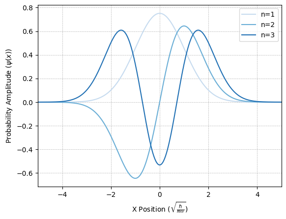

# QuantumHarmonics
### Author: Adill Al-Ashgar
#### Solving the Time-Independant Schrödinger Equation numerically to find the stationary wavefunctions and allowed energy states of a quantum system. 

 

 

# Table of Contents
- [Introduction](#Introduction)
- [Part 1 - The Quantum Harmonic Oscillator](#Part-1---The-Quantum-Harmonic-Oscillator)
  - [Analytical Solution](#Analytical-Solution)
  - [Simulation](#Simulation)
  - [Combined Visulisation for QHO](#Combined-Visulisation-for-QHO)
- [Part 2 - The Hydrogen Atom](#Part-2---The-Hydrogen-Atom)
  - [Analytical Solution](#Analytical-Solution-1)
  - [Simulation](#Simulation-1)
  - [Combined Visulisation for Hydrogen Atom](#Combined-Visulisation-for-Hydrogen-Atom)
- [Part 3 - The Hydrogen Atom with l > 0](#Part-3---The-Hydrogen-Atom-with-$l-\neq-0$)
  - [Simulation](#Simulation-2)
  - [Combined Visulisations](#Combined-Visulisation-for-Hydrogen-Atom-at-$l-\neq-0$)
- [Appendix](#Appendix)
  - [Stability](#Stability)
  - [Performance](#Performance)
  - [QHO Analytical Wavefunction Reference Table](#QHO-Analytical-Wavefunction-Reference-Table)
- [Contributing](#Contributing)
- [Contact](#Contact)
- [Acknowledgements](#Acknowledgements)
- [Liscence](#Liscence)

# Introduction
Our current best understanding of the most fundamental aspects of our universe come from Quantum Mechanics. Central to this framework is the Schrödinger equation, a core equation that governs the behaviour of non-reletivistic quantum systems. Solving a form of this equation known as the Time-Independent Schrödinger Equation or 'TISE' in the position basis reveals the quantized energy levels and spatial distribution of a quantum system. The TISE solves for the **stationary states** and is often used to solve for systems where the potential is constant over time. Analytical solutions are often infeasible for complex systems, necessitating numerical techniques. This project is designed to solve the TISE numerically for various quantum systems and visualize the results. A comparison is made to some well understood examples that have exact analytical solutions in order to validate the numerical results and quantify our accuracy. We will specifically be solving for the **Energy Levels** and **Wavefunctions**, the latter of which will be used to calculate the **Probability Density** of the systems spatial distribution.

The energy levels $E_n$ and the wavefunctions $\psi$ of a non-reletivistic quantum system can be calculated from the **eigenvalues** and **eigenvectors** of the Schrödinger equation. The TISE equation in 1D can be written,

$$
\hat{H} \psi = \hat{E} \psi \tag{4} 
$$

where $\hat{E}$ is the energy operator and the Hamiltonian operator $\hat{H}$ is given by,

$$
\hat{H} = \frac{-\hbar^2}{2m}\frac{d^2}{dx^2} + V \tag{5}
$$

here $\hbar$ is the reduced Planck constant, $m$ is the mass of the system and $V$ is the potential energy. The Hamiltonian operator is a sum of the kinetic energy operator and the potential energy operator. The kinetic energy operator is given by the second derivative of the wavefunction with respect to position, and the potential energy operator is a function of position. The eigenvalues of the Hamiltonian operator are the energy levels of the system, and the eigenvectors are the wavefunctions. The probability density of the system is given by the absolute square of the wavefunction, $|\psi|^2$.

# Part 1 - The Quantum Harmonic Oscillator 
The Quantum Harmonic Oscillator (QHO) is a fundamental concept in quantum mechanics, serving as an analogue to the classical harmonic oscillator. The classical harmonic oscillator represents a system with a quadratic potential, oscillating about an equilibrium position, such as a vibrating diatomic molecule or pendulum, the QHO extends this understanding into the quantum realm. The QHO is a good example to begin building our simulation since it has exact analytic solutions we can use to validate our results.

For the quantum harmonic oscillator, the potential $V$ is,

$$
V(x) = \frac{1}{2}m \omega^2 x^2   \tag{6}
$$

where $\omega$ is the angular frequency of the oscillator. We can see that it is a quadratic potential, following the form of the classical harmonic oscillator, with $k$ the spring constant being equal to $m \omega^2$.

*The potential* $V$ *for the Quantum Harmonic Oscillator shown as a function of* $x$*, we can see that it is quadratic, which is the defining feature of the QHO. The potential is continuous and goes to* $+\infty$ *in its limits.*

## Analytical Solution

### Energy Levels
When solved analytically the **Energy Levels**, $E_n$, of the QHO are given by :

$$
E_n = \hbar \omega (n + \frac{1}{2})  \tag{1}
$$

**where $n$ is a non-negative integer representing the primary quantum number** of the energy level, $\hbar$ is the reduced Planck constant, and $\omega$ is the angular frequency of the oscillator. 

This equation represents the **quantization** of energy levels in the QHO. Quantisation is a core idea of Quantum Mechanics (hence the name). In the case of the QHO, each energy level is equally spaced, with a separation of $\hbar \omega$ between adjacent levels and the eigenvalues are simply $n + \frac{1}{2}$. Given we are expressing energy in terms of $\frac{1}{2} \hbar \omega$, the energy levels simplify to odd integers given by $2n + 1$.

| n   | Analytical Result | In terms of $\frac{1}{2}ℏ𝜔$ |
|-----|------------------|-------------------|
| 1   | $\frac{1}{2}ℏ𝜔$  | 1                 |
| 2   | $1\frac{1}{2}ℏ𝜔$ | 3                 |
| 3   | $2\frac{1}{2}ℏ𝜔$ | 5                 |
| 4   | $3\frac{1}{2}ℏ𝜔$ | 7                 |
| 5   | $4\frac{1}{2}ℏ𝜔$ | 9                 |
| 6   | $5\frac{1}{2}ℏ𝜔$ | 11                |
| 7   | $6\frac{1}{2}ℏ𝜔$ | 13                |
| ... | ...              | ...               |

*The table shows the first seven analytically derived energy states for the Quantum Harmonic Oscillator, we see that when the energy is expressed in terms of* $\frac{1}{2}ℏ𝜔$ *the energy levels are simply odd integers given by* $2n + 1$*.*

### Wavefunctions
The analytical **wavefunctions** $\psi_n$ of the QHO are given by,

$$
\psi_n(x) = \frac{1}{\sqrt{2^n n! \sqrt{\pi}}} e^{-\frac{x^2}{2}} H_n(x) \tag{2}
$$

This equation is made up of three terms, $\frac{1}{\sqrt{2^n n! \sqrt{\pi}}}$ is the normalization constant which ensures that the wavefunction is properly normalized, i.e. $\int_{-\infty}^{\infty} |\psi_n(x)|^2 dx = 1$. Next is the Gaussian term $e^{-\frac{x^2}{2}}$ representing the ground state probability distribution, which peaks at $x=0$ and decays rapidly as $x$ moves away from zero, and finally $H_n(x)$ is the Hermite polynomial of degree $n$, given by,

$$
H_n(x) = (-1)^n e^{x^2} \frac{d^n}{dx^n} e^{-x^2} \tag{3}
$$

Solving for the first three wavefunctions we get the following:

| Term | Normalisation Prefactor| Gaussian | Hermite Polynomial | Wavefunction Expression |
|------|------------|---------|--------|---------|
| 1 | $\frac{1}{\sqrt[4]{\pi}}$ | $e^{- \frac{x^{2}}{2}}$ | $1$ | $\frac{e^{- \frac{x^{2}}{2}}}{\sqrt[4]{\pi}}$ |
| 2 | $\frac{\sqrt{2}}{2 \sqrt[4]{\pi}}$ | $e^{- \frac{x^{2}}{2}}$ | $2 x$ | $\frac{\sqrt{2} x e^{- \frac{x^{2}}{2}}}{\sqrt[4]{\pi}}$ |
| 3 | $\frac{\sqrt{2}}{4 \sqrt[4]{\pi}}$ | $e^{- \frac{x^{2}}{2}}$ | $4 x^{2} - 2$ | $\frac{\sqrt{2} \cdot \left(4 x^{2} - 2\right) e^{- \frac{x^{2}}{2}}}{4 \sqrt[4]{\pi}}$ |
|...|...|...|...|...|

*The first three analytically solved wavefunctions for the Quantum Harmonic Oscillator. See [Appendix Section 1.3](#Appendix_QHOreferencetable) for a more comprehensive reference table.*

It is hard to get an idea of what these wavefunctions look like from the above table, but if we now plot the wavefunctions against the displacement in $x$ we get a much clearer view of their shape and how that changes with the energy level.

*The first three analytically solved wavefunctions for the Quantum Harmonic Oscillator plotted against position*

## Simulation 

### Methodology
We will now attempt to calculate the energy levels and wavefunctions of the same QHO system, this time by solving the TISE using numerical methods. We can then compare the results to the exact analytical solutions shown above to validate our methodology.

To find a numerical solution, we can divide the spatial dimension into $N$ discrete points, $x_i$, and evaluate $\psi$ at each one.  Given this, equation 3 becomes a matrix equation, with $\psi$ an $N$-dimensional vector, and $H$ an $(N \times N)$ matrix.  We can then find the eigenvalues and eigenfunctions of the equation using numerical methods.

In order to define the matrix $\hat{H}$, we can use a discrete approximation of the 2nd derivative,

$$ 
\frac{d^2}{dx^2} \psi(x_i) \approx \frac{\psi_{i-1} - 2\psi_i + \psi_{i+1}}{(\Delta x)^2}  \tag{7}
$$

where $(\Delta x)$ is the distance between discrete points $x_i$. We will choose dimensionless units for each problem, where $x$ is measured in terms of a length $a$, and $E$ is therefore measured in units of $\frac{\hbar^2}{2m a^2}$.  We can therefore write the kinetic energy term of the Hamiltonian as a "tri-diagonal" matrix $D$, which has the leading diagonal,

$$
D_{i,i} = \frac{2}{(\Delta x)^2}  \tag{8}
$$

and the diagonals above and below this are,

$$
D_{i,i+1} = D_{i,i-1} = \frac{-1}{(\Delta x)^2}   \tag{9}
$$

If we choose to measure $x$ in units of $\sqrt{\frac{\hbar}{m \omega}}$, then $E$ will be measured in units of $\frac{1}{2}\hbar \omega$, and the potential can be written,

$$
V_i(x_i) = i^2 (\Delta x)^2 = x_i^2   \tag{10}
$$

The potential term can be represented by a matrix where the leading diagonal is the potential evaluated at the $i$-th point in space, $V_{i,i} = V(x_i)$, and all other entries are zero. 

Then using a linear algebra solver, we can solve for the eigenvalues and eigenvectors of $H$ to find the energy levels $E_n$ and wavefunctions $\psi$ of the quantum harmonic oscillator respectively. For performance reasons we currently use the scipy.linalg.eigh_tridiagonal function, benefiting from its tailored functionality for diagonal and tridiagonal matrices. This is discussed further in [Appendix Section 2.2](#Appendix_performance).

##### *NOTE: It is important to use a small* $(\approx 0.1 a_o)$ *step size for* $\Delta x$*. Additionally the x range (from which follows the range for the potential) must cover sufficient range that the largest desired wavefunction falls to zero at the extremities in order to ensure the numerical solutions stability as demonstrated in [Appendix Section 2.1](#Appendix_stability).*

### Energy Levels

We compare the computed eigenvalues with the expected eigenvalues.

Looking back on our table of analytical values for the energy levels and filling in our simulated values we can see we get a good match between the two, with the error gradually increasing as the energy level increases. This is to be expected as the wavefunctions become more complex and the numerical solutions become less stable. 

| n   | Analytical Result| in terms of $\frac{1}{2}ℏ𝜔$ | Simulation Result | Simulation Error |
|-----|------------------|-------------------|-------------------|----|
| 1   | $\frac{1}{2}ℏ𝜔$  | 1                 | 1.00              |0.00|
| 2   | $1\frac{1}{2}ℏ𝜔$ | 3                 | 3.00              |0.00|
| 3   | $2\frac{1}{2}ℏ𝜔$ | 5                 | 4.99              |0.01|
| 4   | $3\frac{1}{2}ℏ𝜔$ | 7                 | 6.98              |0.02|
| 5   | $4\frac{1}{2}ℏ𝜔$ | 9                 | 8.97              |0.03|
| 6   | $5\frac{1}{2}ℏ𝜔$ | 11                | 10.96             |0.04|
| 7   | $6\frac{1}{2}ℏ𝜔$ | 13                | 12.95             |0.05|
| ... | ...              | ...               | ...               |... |

*Comparison between analytical and simulated results for the first seven energy levels for the QHO*

To get a better idea of the error we can plot it as a function of n, the results show good agreement between simulation and analytical results, a full exploration of the error as a function of the input parameters is given in [Appendix Section 2.1](#Appendix_stability). 

*The left-hand plot shows the results for the first 100 energy levels of our simulation compared to the analytical results shown in red. The plot on the right shows both the absolute error (shown in green and referenced to the left y-axis) and the relative error as a percentage of the true value (shown in yellow and reference to the right hand y-axis.)*

### Wavefunctions
We can also compare our numerically computed wavefunctions to their analytical counterparts to check that our simulation is working as expected. 

*Comparison between the first four simulated and analytically derived QHO wavefunctions and probability densities. Although there is a phase mismatch to one of the wavefunctions, we find agreement between all the probability distributions.*

In this visual comparison we can see that the wavefunctions are in good agreement with the analytical solutions, with the only difference being a phase factor in one of the waves. This is to be expected as the phase is not a physical observable and is therefore not unique. This phase shift does not affect the probability density, which we find to be in good agreement with the analytical solutions. This is quantified further in [Appendix Section 2.1](#Appendix_stability).

Now we have verified our simulation works as expected, we can move on to visualising the wavefunctions and probability density of the QHO in more detail.

*The left-hand plots in blue show the simulated wavefunctions for the QHO corresponding values of* $n$ *from 1-9 with* $l=0$*. The right-hand plots in red show the corresponding probability densities. We can see that the number of maxima in the probability density is equal to* $n$ *and the number of turning points is* $2n+1$*.*

## Combined Visualisation for QHO

Putting together the results and visualisations generated so far, we can see the relationship between the potential and the probability density of the QHO. Each probability density is plotted at the energy given by its corresponding energy level eigenvalue. We see how the potential forms a well in which the wavefunctions/probability densities are confined, classically this potential is an absolute limit, however we can see that the probability densities extend beyond this point, this is a key feature of quantum mechanics, and is a result of the wave-like nature of the electron. 

*The dotted u shape line shows the potential, the left-hand plot shows the simulated wavefunctions, plotted at the energy corresponding to their energy eigenvalue. The right-hand plot shows the same but with the probability densities rather than wavefunctions. Classically the probability of existing outside of the potential limits is not allowed, this is one of the disagreements between classical and quantum theory.*

# Part 2 - The Hydrogen Atom
Having verified our method, we can use it to solve a slightly more complex system - the Hydrogen atom. We will use same methodology as before but change the potential to that of the hydrogen atom. The eigenvalues and eigenvectors will then yeild the energy levels and wavefunctions which we shall again compare to analytical results.

In addition to having to change the potential, we will also change to a spherical coordinate system to simplify our calculations. In such a spherically symmetric system, the wavefunction can be written,

$$
\frac{1}{r}\Psi(r)Y_{lm}(\theta, \phi)e^{i m\phi} \tag{11}
$$

where $Y_{lm}(\theta, \phi)$ are the spherical harmonic functions and l, m are the angular momentum quantum numbers. The radial function $\Psi(r)$ satisfies the time-independent Schrödinger equation, provided a suitable term is added to the potential.

Now that we are using a spherical coordinate system, we discritise a range of radius values, $r$, instead of $x$. If we use the Bohr radius $a_0$ as the unit $r$, where :

$$
a_0 = \frac{4 \pi \epsilon \hbar^2}{m_e e^2}  \tag{12}
$$

then the energy will be measured in units of :

$$
\frac{m_e e^4}{2 (4 \pi \epsilon_0)^2 \hbar^2}  \tag{13}
$$

## Analytical Solution

### Energy Levels

Given the units we have selcted to work in for convieience, the analytically derived energy levels of the hydrogen atom are given by the formula,

$$
E_n = -\frac{1}{n^2}
$$

| n   | Analytical Result | in terms of $\frac{m_e e^4}{2 (4 \pi \epsilon_0)^2 \hbar^2}$
|-----|-----------------------------------------------------------------|----------|
| 1   | $-1 \frac{m_e e^4}{2 (4 \pi \epsilon_0)^2 \hbar^2}$             | -1.0000  | 
| 2   | $-\frac{1}{4} \frac{m_e e^4}{2 (4 \pi \epsilon_0)^2 \hbar^2}$   | -0.2500  |
| 3   | $-\frac{1}{9} \frac{m_e e^4}{2 (4 \pi \epsilon_0)^2 \hbar^2}$   | -0.1111  | 
| 4   | $-\frac{1}{16} \frac{m_e e^4}{2 (4 \pi \epsilon_0)^2 \hbar^2}$  | -0.0625  |
| 5   | $-\frac{1}{25} \frac{m_e e^4}{2 (4 \pi \epsilon_0)^2 \hbar^2}$  | -0.0400  | 
| 6   | $-\frac{1}{36} \frac{m_e e^4}{2 (4 \pi \epsilon_0)^2 \hbar^2}$  | -0.0278  | 
| 7   | $-\frac{1}{49} \frac{m_e e^4}{2 (4 \pi \epsilon_0)^2 \hbar^2}$  | -0.0204  | 
| ... | ...                                                             | ...      | 

*The table shows the first seven analytically derived energy states for the Hydrogen atom, we can see that the energy levels are a multiple of the ground state energy, -1.0000, as expected.*

## Simulation

### Methodology

Given our choice of units the potential for the hydrogen atom can be written :

$$
V(r_i) = \frac{-2}{r_i} + \frac{l(l+1)}{r_i^2} \tag{14}
$$

This potential is the sum of the classical attractive Coulomb interaction between the electron and the nucleus, and an additional term dependent on the **azimuthal quantum number** $l$. This term is related to the centrifugal potential, which arises due to the angular momentum of the electron. 

Initially we will focus only on this case where $l=0$, and then later we will explore the effects of changing $l$.

*The potential for Hydrogen when the value of quantum number* $l$ *is zero. This is effectivly the electrostatic Columb potential. The potential for* $l=0$ *is continuous, going to* $-\infty$ *in its limit, resulting in a spherically symetrical potential*

We can now use the same method as outlined in [Part 1](#Part-1---The-Quantum-Harmonic-Oscillator) to create the kinetic energy term matrix $D$ and add it to the potential $V$, to find the Hamiltonian matrix $H$. We agin use our linear algebra solver to find the eigenvalues and eigenvectors of $H$, and compare the results to the expected eigenvalues and wavefunctions, this time for the Hydrogen atom.

##### *NOTE: We must use a range of* $r$ *such that the wavefunction become negligible, and a large number of* $r$ *points, at least 1000, to ensure the numerical solutions stability as demonstrated in [Appendix Section 2.1](#Appendix_stability).*

### Energy Levels

| n   | Analytical Result | in terms of $\frac{m_e e^4}{2 (4 \pi \epsilon_0)^2 \hbar^2}$ | Simulation Result ($\frac{m_e e^4}{2 (4 \pi \epsilon_0)^2 \hbar^2}$) | Simulation Error ($\frac{m_e e^4}{2 (4 \pi \epsilon_0)^2 \hbar^2}$) |
|-----|------------------|-------------------------------|-------------------|------|
| 1   | $-1 \frac{m_e e^4}{2 (4 \pi \epsilon_0)^2 \hbar^2}$  | -1.0000                      | -1.0433           |-0.0433|
| 2   | $-\frac{1}{4} \frac{m_e e^4}{2 (4 \pi \epsilon_0)^2 \hbar^2}$  | -0.2500                      | -0.2553           |-0.0053|
| 3   | $-\frac{1}{9} \frac{m_e e^4}{2 (4 \pi \epsilon_0)^2 \hbar^2}$  | -0.1111                      | -0.1127           |-0.0017|
| 4   | $-\frac{1}{16} \frac{m_e e^4}{2 (4 \pi \epsilon_0)^2 \hbar^2}$  | -0.0625                      | -0.0632           |-0.0007|
| 5   | $-\frac{1}{25} \frac{m_e e^4}{2 (4 \pi \epsilon_0)^2 \hbar^2}$  | -0.0400                      | -0.0403           |-0.0003|
| 6   | $-\frac{1}{36} \frac{m_e e^4}{2 (4 \pi \epsilon_0)^2 \hbar^2}$  | -0.0278                      | -0.0280           |-0.0002|
| 7   | $-\frac{1}{49} \frac{m_e e^4}{2 (4 \pi \epsilon_0)^2 \hbar^2}$  | -0.0204                      | -0.0205           |-0.0001|
| ... | ...            | ...               | ...               |...|

*Comparison between analytical and simulated results for the first seven energy levels for the Hydrogen electron*

To convert our dimensionless results given in terms of $\frac{m_e e^4}{2 (4 \pi \epsilon_0)^2 \hbar^2}$ we can solve for the energy levels in terms of eV, by inputting the required constants,

- $m_e$: mass of an electron $\approx 9.109 \times 10^{-31}$ kg
- $e$: elementary charge $\approx 1.602 \times 10^{-19}$ C
- $\epsilon_0$: vacuum permittivity $\approx 8.854 \times 10^{-12}$ F/m
- $\hbar$: reduced Planck constant $\approx 1.055 \times 10^{-34}$ J·s

Which yeilds :

$$
\frac{(9.109 \times 10^{-31}) \times (1.602 \times 10^{-19})^4}{2 \times (4 \pi \times 8.854 \times 10^{-12})^2 \times (1.055 \times 10^{-34})^2} \approx 13.606 \, \text{eV}  \tag{23}
$$

Which we know is the energy of the ground state of the hydrogen atom, and each energy level is a multiple of this value. We can then convert our dimensionless results to eV by multiplying by 13.606.

| n   | Analytical Result (eV) | Simulation Result (eV) | Simulation Error (eV)|
|-----|-------------------------------|-------------------|------|
| 1   | -13.6060                     | -14.1712          | -0.5905|
| 2   | -3.4015                      | -3.4713           | -0.0721|
| 3   | -1.5095                      | -1.5318           | -0.0232|
| 4   | -0.8547                      | -0.8597           | -0.0095|
| 5   | -0.5442                      | -0.5488           | -0.0041|
| 6   | -0.3774                      | -0.3801           | -0.0014|
| 7   | -0.2768                      | -0.2796           | -0.0007|
| ... | ...                          | ...               |...|

*Comparison between analytical and simulated results for the first seven energy levels for the Hydrogen electron with the energy values converted to eV*

### Wavefunctions

*The left hand plots show the first 9 simulated wavefucntions,* $\psi$*, for the hydrogen atom with* $l = 0$*, to the right hand side are the corresponding probability densities,* $|\psi|^2$*. Pay attention to the y-axis scale for each graph as they are not the same. We know that the integral of the probability density over all space is equal to one, so they all have the same area beneath the curve, however this is spread over a greater region as* $n$ *increases causing the maximum amplitude to decrease.*

We can see from our findings that the proabability densitys correctly predict what we observe in the real world, which is that electrons with higher energy will be found further from the nucleus, The peak of the probability density is the most likely place to find the electron, and this correspond to the classically predicted radius. However, There is also a probability of a higher energy electron being found closer to the nucleus than predicted by classical physics (or further away). This is a result of the wave nature of the electron, and is a key feature of quantum mechanics.

## Combined Visulisation for Hydrogen Atom at $l = 0$

*The plot shows the simulated probability density corresponding to the wavefunctions for* $n = 1$ *through to* $n=5$ *overlayed upon the potential. Each probability density is plotted at corresponding energy level* $E_n$ *calulated through the simulation.*

We can get an idea of how the probability density manifests by adding some perspective shifted circles onto our plot to indicate the maxima of the probability density. It is important to note these are mereley a guide to the eye, to highlight the local maximas, the probability density is a continuous function and is not limited to these circled radii.

*Same plot as shown above with the added guides marking out the local maxima for each probability density.*

The energy scale describes the required energy to move the electron from its bound state to infinity, a simpler way to think of it is the sum total energy of the nucleas and the electron is this much lower (hence the negative) than if they were seperated by an infinite distance

So far we have been calculating in one dimension, but the hydrogen atom is a three-dimensional system. Fortunatly, in the $l = 0$ case, the wavefunctions are spherically symmetric, so we can extend our 1D results to 2D and 3D by simply squaring the wavefunction to get the probability density, and then plotting the probability density as a function of the radial distance from the nucleus.

*We can expand our soloution to 2D in this case where* $l = 0$ *as it is perfectly spherically symetrical. The image on top has the first ten probability densities plotted with a fixed x and y scale to visulise how the range over which the probability density extends grows as* $n$ *is increased. The image on the bottom shows us the same thing however with slightly scaled x and y axes to make it easier to identify the number of maxima in the probability density and how that grows with increasing* $n$*.*

# Part 3 - The Hydrogen Atom with $l \neq 0$

If we retrun to our hydrogen potential, given by equation 14, and change the value of $l$ we can see how the potential changes. If we analyse how the overall potential changes with respect to $l$ we end up with two distinct cases:

When $l = 0$, the term $l(l+1)/r^2$ vanishes, and the potential reduces to $V_{\text{hyd}} = -2/r$, which in non-atomic units corresponds to the classical coulumb potential for electrostsatic interaction between the electron and the nucleus. This is the case we explored in the previous section, and the potential, wavefunctions and the probability density are all spherically symmetric, as demonstrated. For those familliar with the orbital shell model, this corresponds to the s orbital.

For $l > 0$, the term $l(l+1)/r^2$ becomes non-zero. This term contributes an additional repulsive component to the potential. As $l$ increases, this repulsive centrifugal potential becomes stronger. This reflects the fact that electrons in higher angular momentum states experience a stronger "centrifugal force" due to their higher orbital angular momentum. This is how we get our different orbital shapes, p, d, f, etc.

*Hydrogen potential varying* $l$*. We can see that when* $l = 0$ *the potential is the standard columb potential, but as it increases, the repulsive force due to the centrifugal term grows larger. The most interesting aspect of this is that we can see that where* $l \neq 0$ *the potential is discontinous, resulting in the charecteristic shapes.*

*3D representation of the shape of the Hydrogen orbitals as* $l$ *is varied. We see the sperically symetric case of* $l=0$ *and the bilatteral symetry where* $l\neq0$.

Overall, for higher values of $l$, the potential energy becomes more repulsive at shorter distances compared to the $l = 0$ case, reflecting the increased centrifugal effect due to the higher angular momentum of the electron. This behavior is characteristic of the different shapes of orbitals associated with different values of $l$ in atomic systems.

If we now wgain plot the wavefucntions and probability density for the hydrogen atom, but this time for a range of l values, we can see how the position of the maxima changes as $l$ increases.

*Plot again shows the wavefunctions on the left and the probability dewnsities on the right. This time we plot a range of* $l$ *values for the hydrogen atom, we can see that as* $l$ *increases the position of the maxima moves further away from the nucleus. This is the result of the repulsive centrifugal potential that is added to the standard columb potential when* $l\neq 0$. *We can also see that the maximum possible* $l$ *value is dependant on the value of* $n$*, and is given by* $l_{\text{max}} = n-1$.

# Appendix

## Stability
To be updated.

## Performance
To be updated. 

## QHO Analytical Wavefunction Reference Table:

| Term | Normalisation Prefactor| Gaussian | Hermite Polynomial | Wavefunction Expression |
|------|------------|---------|--------|---------|
| 1 | $\frac{1}{\sqrt[4]{\pi}}$ | $e^{- \frac{x^{2}}{2}}$ | $1$ | $\frac{e^{- \frac{x^{2}}{2}}}{\sqrt[4]{\pi}}$ |
| 2 | $\frac{\sqrt{2}}{2 \sqrt[4]{\pi}}$ | $e^{- \frac{x^{2}}{2}}$ | $2 x$ | $\frac{\sqrt{2} x e^{- \frac{x^{2}}{2}}}{\sqrt[4]{\pi}}$ |
| 3 | $\frac{\sqrt{2}}{4 \sqrt[4]{\pi}}$ | $e^{- \frac{x^{2}}{2}}$ | $4 x^{2} - 2$ | $\frac{\sqrt{2} \cdot \left(4 x^{2} - 2\right) e^{- \frac{x^{2}}{2}}}{4 \sqrt[4]{\pi}}$ |
| 4 | $\frac{\sqrt{3}}{12 \sqrt[4]{\pi}}$ | $e^{- \frac{x^{2}}{2}}$ | $8 x^{3} - 12 x$ | $\frac{\sqrt{3} \cdot \left(8 x^{3} - 12 x\right) e^{- \frac{x^{2}}{2}}}{12 \sqrt[4]{\pi}}$ |
| 5 | $\frac{\sqrt{6}}{48 \sqrt[4]{\pi}}$ | $e^{- \frac{x^{2}}{2}}$ | $16 x^{4} - 48 x^{2} + 12$ | $\frac{\sqrt{6} \cdot \left(16 x^{4} - 48 x^{2} + 12\right) e^{- \frac{x^{2}}{2}}}{48 \sqrt[4]{\pi}}$ |
| 6 | $\frac{\sqrt{15}}{240 \sqrt[4]{\pi}}$ | $e^{- \frac{x^{2}}{2}}$ | $32 x^{5} - 160 x^{3} + 120 x$ | $\frac{\sqrt{15} \cdot \left(32 x^{5} - 160 x^{3} + 120 x\right) e^{- \frac{x^{2}}{2}}}{240 \sqrt[4]{\pi}}$ |
| 7 | $\frac{\sqrt{5}}{480 \sqrt[4]{\pi}}$ | $e^{- \frac{x^{2}}{2}}$ | $64 x^{6} - 480 x^{4} + 720 x^{2} - 120$ | $\frac{\sqrt{5} \cdot \left(64 x^{6} - 480 x^{4} + 720 x^{2} - 120\right) e^{- \frac{x^{2}}{2}}}{480 \sqrt[4]{\pi}}$ |
| 8 | $\frac{\sqrt{70}}{6720 \sqrt[4]{\pi}}$ | $e^{- \frac{x^{2}}{2}}$ | $128 x^{7} - 1344 x^{5} + 3360 x^{3} - 1680 x$ | $\frac{\sqrt{70} \cdot \left(128 x^{7} - 1344 x^{5} + 3360 x^{3} - 1680 x\right) e^{- \frac{x^{2}}{2}}}{6720 \sqrt[4]{\pi}}$ |
| 9 | $\frac{\sqrt{70}}{26880 \sqrt[4]{\pi}}$ | $e^{- \frac{x^{2}}{2}}$ | $256 x^{8} - 3584 x^{6} + 13440 x^{4} - 13440 x^{2} + 1680$ | $\frac{\sqrt{70} \cdot \left(256 x^{8} - 3584 x^{6} + 13440 x^{4} - 13440 x^{2} + 1680\right) e^{- \frac{x^{2}}{2}}}{26880 \sqrt[4]{\pi}}$ |
| 10 | $\frac{\sqrt{35}}{80640 \sqrt[4]{\pi}}$ | $e^{- \frac{x^{2}}{2}}$ | $512 x^{9} - 9216 x^{7} + 48384 x^{5} - 80640 x^{3} + 30240 x$ | $\frac{\sqrt{35} \cdot \left(512 x^{9} - 9216 x^{7} + 48384 x^{5} - 80640 x^{3} + 30240 x\right) e^{- \frac{x^{2}}{2}}}{80640 \sqrt[4]{\pi}}$ |
| 11 | $\frac{\sqrt{7}}{161280 \sqrt[4]{\pi}}$ | $e^{- \frac{x^{2}}{2}}$ | $1024 x^{10} - 23040 x^{8} + 161280 x^{6} - 403200 x^{4} + 302400 x^{2} - 30240$ | $\frac{\sqrt{7} \cdot \left(1024 x^{10} - 23040 x^{8} + 161280 x^{6} - 403200 x^{4} + 302400 x^{2} - 30240\right) e^{- \frac{x^{2}}{2}}}{161280 \sqrt[4]{\pi}}$ |
| 12 | $\frac{\sqrt{154}}{3548160 \sqrt[4]{\pi}}$ | $e^{- \frac{x^{2}}{2}}$ | $2048 x^{11} - 56320 x^{9} + 506880 x^{7} - 1774080 x^{5} + 2217600 x^{3} - 665280 x$ | $\frac{\sqrt{154} \cdot \left(2048 x^{11} - 56320 x^{9} + 506880 x^{7} - 1774080 x^{5} + 2217600 x^{3} - 665280 x\right) e^{- \frac{x^{2}}{2}}}{3548160 \sqrt[4]{\pi}}$ |
| 13 | $\frac{\sqrt{231}}{21288960 \sqrt[4]{\pi}}$ | $e^{- \frac{x^{2}}{2}}$ | $4096 x^{12} - 135168 x^{10} + 1520640 x^{8} - 7096320 x^{6} + 13305600 x^{4} - 7983360 x^{2} + 665280$ | $\frac{\sqrt{231} \cdot \left(4096 x^{12} - 135168 x^{10} + 1520640 x^{8} - 7096320 x^{6} + 13305600 x^{4} - 7983360 x^{2} + 665280\right) e^{- \frac{x^{2}}{2}}}{21288960 \sqrt[4]{\pi}}$ |
| 14 | $\frac{\sqrt{6006}}{553512960 \sqrt[4]{\pi}}$ | $e^{- \frac{x^{2}}{2}}$ | $8192 x^{13} - 319488 x^{11} + 4392960 x^{9} - 26357760 x^{7} + 69189120 x^{5} - 69189120 x^{3} + 17297280 x$ | $\frac{\sqrt{6006} \cdot \left(8192 x^{13} - 319488 x^{11} + 4392960 x^{9} - 26357760 x^{7} + 69189120 x^{5} - 69189120 x^{3} + 17297280 x\right) e^{- \frac{x^{2}}{2}}}{553512960 \sqrt[4]{\pi}}$ |
| 15 | $\frac{\sqrt{858}}{1107025920 \sqrt[4]{\pi}}$ | $e^{- \frac{x^{2}}{2}}$ | $16384 x^{14} - 745472 x^{12} + 12300288 x^{10} - 92252160 x^{8} + 322882560 x^{6} - 484323840 x^{4} + 242161920 x^{2} - 17297280$ | $\frac{\sqrt{858} \cdot \left(16384 x^{14} - 745472 x^{12} + 12300288 x^{10} - 92252160 x^{8} + 322882560 x^{6} - 484323840 x^{4} + 242161920 x^{2} - 17297280\right) e^{- \frac{x^{2}}{2}}}{1107025920 \sqrt[4]{\pi}}$ |
|...|...|...|...|...|

*Analytical wavefunctions for the Quantum Harmonic Oscillator generated. Abriged to the first 15 terms due to GitHub's column width. Full 100 terms available at [Full Reference Table](https://github.com/Adillwma/QuantumHarmonics/blob/main/QHO_Wavefunctions_Analytical_Reference_Table_Adill_Al-Ashgar.md)*

# License
This project is not currently licensed. For more information please get in touch via the contact details below.

# Contributing
Contributions to this codebase are welcome! If you encounter any issues, bugs or have suggestions for improvements please open an issue or a pull request on the [GitHub repository](https://github.com/Adillwma/QuantumHarmonics).

# Contact
[adill@neuralworkx.com](mailto:adill@neuralworkx.com).

# Acknowledgements
Prof. Sandu Popescu, FRS, for many inspiring and enlightening lectures. 
